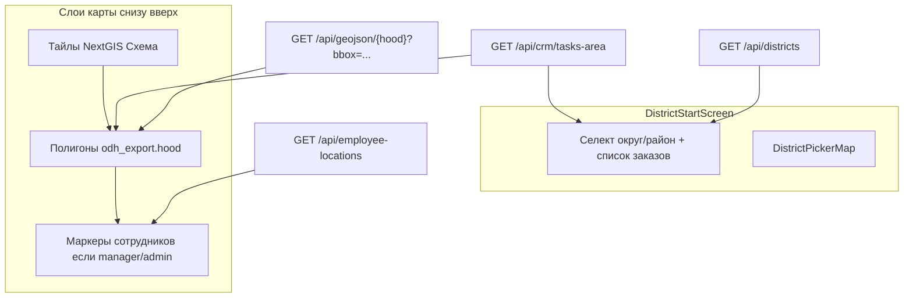

# Карта стартового экрана (до выбора района)

Справочник для разработчика, который строит отдельный дашборд (Streamlit) с той же картой, что видит пользователь WebCRM **до** нажатия «Получить задачу» / «Загрузить задачи».

Это не рабочая карта после сбора слоёв. Это **карта-пикер района**: полигоны районов Москвы, раскрашенные по площадным заказам. Контуры самих заказов на этой карте **не рисуются**.

Целевая база: PostgreSQL/PostGIS `monitor` на проде **172.21.198.219** (Docker `monitor-db`, пользователь `monitor`). Дашборд должен **только читать**. Не писать в `crm.tasks*`. Скрипты из `sql/one_time/` не запускать.

Компоненты WebCRM: [`frontend/src/components/DistrictStartScreen.tsx`](../frontend/src/components/DistrictStartScreen.tsx) + [`frontend/src/components/DistrictPickerMap.tsx`](../frontend/src/components/DistrictPickerMap.tsx). Правила цвета: [`frontend/src/lib/districtOrderStyle.ts`](../frontend/src/lib/districtOrderStyle.ts).

---

## 1. Что видит пользователь

После логина, пока район не выбран (или выбран, но сбор ещё не запущен):

- слева — карточка: округ, район, кнопка сбора, опционально список площадных заказов;
- справа — Leaflet-карта с подсказкой «Или выберите район на карте».

Клик по полигону района = выбрать этот район (и подставить его округ). Tooltip полигона — нормализованное имя района. Popup — список площадных заказов этого района (номер + три чипа статусов).

Пока заказы грузятся (`areaOrdersReady = false`), районы рисуются **устаревшим** красным стилем (`HOOD_STYLE_DEFAULT`), а не серым «пустым». После загрузки включается агрегация по заказам.



---

## 2. Слои карты

Порядок снизу вверх. Контуры заказов (`crm.tasks_area.geom`) на этом экране **не кладутся отдельным слоем**. Геометрия заказа нужна API, но UI использует её только чтобы знать, что заказ существует; заливка идёт по **району**.

### 2.1. Подложка

NextGIS-тайлы, attribution «МГГТ». Переключатель слоёв Leaflet справа сверху.

| id | Подпись | resource | URL |
|----|---------|----------|-----|
| `schema` | Схема (по умолчанию) | 248465 | `http://ngtst.mggt:8080/api/component/render/tile?resource=248465&nd=204&z={z}&x={x}&y={y}` |
| `1_2000` | 1:2000 | 232992 | то же, `resource=232992` |
| `satellite` | Спутник | 303242 | то же, `resource=303242` |

Старт карты: центр `[55.7558, 37.6173]`, zoom `10`, maxZoom `19`.

Код: [`frontend/src/lib/mapBasemap.ts`](../frontend/src/lib/mapBasemap.ts).

### 2.2. Полигоны районов

Слой с `display_name = 'Границы районов'` (`HOOD_BOUNDARIES_DISPLAY_NAME`). Таблица: `odh_export.hood`. Поля:

| Поле | Смысл |
|------|--------|
| `rayon` | имя района |
| `okrug_shor` | короткий код округа |
| `geom` | полигон (в API отдаётся в EPSG:4326) |
| `gid` | id зоны; у полевого/офисного пользователя список районов в селекте режется по `work_zones` |

Загрузка в UI:

```text
GET /api/geojson/{layerKey}?bbox=36.8,55.4,38.2,56.1&limit=500
```

`MOSCOW_MAP_BBOX = '36.8,55.4,38.2,56.1'` (minLon, minLat, maxLon, maxLat). Лимит на стартовой карте **500** (районов Москвы меньше). Дашборду лимит не нужен.

Дальше клиент:

1. выкидывает округа **НАО** и **ТАО** (`EXCLUDED_OKRUG_SHORT`);
2. если в селекте выбран округ — оставляет только его полигоны и `fitBounds`;
3. клик по полигону вызывает `onRayonSelect`.

Выбранный район: обводка `#0d6efd`, weight `3`, `flyToBounds` с `maxZoom: 13`. Невыбранный: weight `2`.

Карта показывает **все** районы Москвы (кроме НАО/ТАО), даже если селект ограничен `work_zones`. Селект и карта живут разными фильтрами.

### 2.3. Маркеры сотрудников

Только если `canManagePersonnel` (роли `manager` / `admin`).

```text
GET /api/employee-locations
```

Источник: `mggt_field.track_real_time` (колонки `user`, `geom`, `time`). Кружок Leaflet, неинтерактивный, tooltip = ФИО из `crm.users`.

Цвет по возрасту метки (`employeeLocationAgeColor`):

| Возраст | Цвет |
|---------|------|
| &lt; 10 мин | `#198754` |
| &lt; 30 мин | `#ffc107` |
| &lt; 60 мин | `#dc3545` |
| старше / нет `time` | `#212529` |

Код: [`frontend/src/lib/employeeLocationStyle.ts`](../frontend/src/lib/employeeLocationStyle.ts). На дашборде этот слой необязателен.

---

## 3. Данные без выбранного района

Стартовый экран сразу (район не нужен) грузит:

| Запрос | Зачем |
|--------|--------|
| `GET /api/districts` | список районов для селекта (без НАО/ТАО; не-admin — только `work_zones`) |
| `GET /api/crm/tasks-area` | все видимые пользователю площадные заказы с геометрией, `limit` 5000 |
| GeoJSON hood, см. выше | полигоны + метаданные округ↔район |
| `GET /api/employee-locations` | только manager/admin |

Список заказов в сайдбаре показывается, если `allowed_task_sources` содержит `'area'`. Раскраска карты использует **полный** ответ `tasks-area`, а не отфильтрованный чекбоксом «Мои в работе». Чекбокс «Мои в работе» (только роль `office`) режет **только сайдбар**.

---

## 4. Нормализация имён

Все сравнения района/округа идут через `normalizeRayonName`: схлопнуть пробелы (включая перевод строки) в один пробел, trim, убрать пробелы вокруг дефиса.

```text
"Марьино - Парк"  →  "Марьино-Парк"
```

В SQL то же самое:

```sql
regexp_replace(
    trim(regexp_replace(coalesce(rayon, ''), '\s+', ' ', 'g')),
    '\s*-\s*',
    '-',
    'g'
)
```

Без нормализации «Ясенево» и «Ясенево » не склеятся, район останется серым (`empty`).

---

## 5. Три режима карты

Переключатель над картой, по умолчанию **Полевое обследование**. Меняет только правило заливки/мигания. Список заказов в popup и сайдбаре всегда показывает все три чипа.

| id | Подпись в UI | Какой статус заказа смотреть |
|----|--------------|------------------------------|
| `field` | Полевое обследование | `crm.tasks_area.status` |
| `pre_analise` | Подготовка данных | workflow по колонкам `pre_analise*` |
| `analise` | Обработка данных | workflow по колонкам `analise*` |

Код: `DISTRICT_MAP_MODES` в [`districtOrderStyle.ts`](../frontend/src/lib/districtOrderStyle.ts).

---

## 6. Статусы заказа

### Поле (`status`)

Тип `AreaStatus`. Неизвестное значение в UI считается `free`.

| Код | Подпись |
|-----|---------|
| `free` | Свободный заказ |
| `wip` | На обследовании |
| `wip_field` | В работе в поле |
| `in_pause` | Приостановлен в поле |
| `done` | Завершённый |

Цвета **контура заказа** (на карте после сбора, не на пикере): `AREA_STATUS_COLORS` — free `#ff9800`, wip/wip_field `#fdd835`, in_pause `#e53935`, done `#43a047`. На стартовой карте эти цвета используются только как база для `done` и `mixed`.

### Офис (workflow)

Одинаковая машина для подготовки и анализа (`AnaliseWorkflowStatus`): `idle` → `in_progress` → `paused` → `done`.

**Подготовка** (`preAnaliseWorkflowStatus`):

1. `pre_analise` истинно (`true` / `t` / `1` / `yes` / `да`) → `done`
2. иначе `pre_analise_paused_at` непусто → `paused`
3. иначе `pre_analise_started_at` непусто → `in_progress`
4. иначе `idle`

**Анализ** (`analiseWorkflowStatus`): то же по `analise`, `analise_paused_at`, `analise_started_at`.

Подписи в чипах:

| Код | Подготовка | Анализ |
|-----|------------|--------|
| `done` | Подготовлен | Обработан |
| `idle` | Не подготовлен | Не обработан |
| `paused` | Приостановлен | Приостановлен |
| `in_progress` | В подготовке (`login`) | В работе (`login`) |

---

## 7. Заливка района

Функция `districtOrderVisual(orders, mode)`. Штриховка (`hatch`) на этом экране **всегда** `'none'` — код штриховки есть для карты после сбора, на пикере не включается.

Порядок правил (после того как заказы загружены):

1. у района **нет** заказов → `empty`
2. **все** заказы «готовы» → `done`
3. **хотя бы один** заказ «простаивает» → `free` (красный, как старый дефолт границ)
4. иначе → `mixed`

Что значит «готовы» / «простаивают»:

| Режим | all done | has idle |
|-------|----------|----------|
| `field` | каждый `status = 'done'` | хотя бы один `status = 'free'` |
| `pre_analise` / `analise` | каждый workflow = `done` | хотя бы один workflow = `idle` |

Цвета заливки (`DISTRICT_FILL_COLORS`, `fillOpacity` 0.35):

| kind | stroke | fill | Когда |
|------|--------|------|--------|
| `empty` | `#212121` | `#212121` | нет заказов в этом районе |
| `done` | `#43a047` | `#43a047` | все заказы готовы в текущем режиме |
| `free` | `#cc0000` | `#ff6666` | есть хотя бы один свободный / idle |
| `mixed` | `#fdd835` | `#fdd835` | всё остальное (в работе, пауза, смесь) |

Пока заказы ещё грузятся — **не** `empty`, а legacy:

```text
HOOD_STYLE_DEFAULT:  stroke #cc0000, fill #ff6666, fillOpacity 0.08
HOOD_STYLE_SELECTED: stroke #0d6efd, fill #0d6efd, fillOpacity 0.25
```

Если загрузка заказов упала, `areaOrdersReady` становится true при пустом списке → все районы `empty` (тёмно-серые).

---

## 8. Мигание

CSS-классы на SVG-path района, 1 с, fill-opacity 0.2 ↔ 0.85.

| blink | Класс | Анимация fill |
|-------|--------|----------------|
| `red` | `area-status-blink-red` | `#e53935` |
| `yellow` | `area-status-blink-yellow` | `#fdd835` |
| `none` | — | нет |

Правило (первое совпадение):

| Режим | red | yellow |
|-------|-----|--------|
| `field` | любой заказ `in_pause` | иначе любой `wip_field` |
| `pre_analise` / `analise` | любой workflow `paused` | иначе любой `in_progress` |

Мигание **поверх** заливки: район может быть жёлтым `mixed` и при этом мигать красным, если внутри есть пауза.

---

## 9. Popup и сайдбар

Один и тот же набор полей. Группировка по нормализованному `rayon`, внутри — сортировка `task_number` (locale `ru`).

Каждый заказ:

1. имя = `task_number`, иначе «—»;
2. чип полевого статуса;
3. чип подготовки;
4. чип анализа.

Пустой район: «Нет площадных заказов».

Сайдбар дополнительно: заголовок «Площадные заказы», для `office` чекбокс «Мои в работе» (`isOwnOpenOfficeOrder` — пользователь начал или поставил на паузу pre-analise или analise). **Карту чекбокс не перекрашивает.**

---

## 10. Что режет API (не копировать слепо)

Дашборд должен рисовать **полную** картину, как admin. HTTP-ручка WebCRM режет ответ по роли — это не модель данных.

| Роль | `GET /api/crm/tasks-area` без района |
|------|--------------------------------------|
| `admin` | все районы, все статусы, `limit` 5000 |
| `office` / `manager` | только районы из `work_zones`, все статусы |
| `field` | районы из `work_zones`; статусы только `wip`, `wip_field`, `in_pause`; плюс `executor IS NULL OR executor = <логин>` |

Селект районов (`GET /api/districts`): не-admin видит только `work_zones`. Карта hood при этом всё равно грузит все полигоны Москвы кроме НАО/ТАО.

Полигоны заказов в ответе `tasks-area` есть (`ST_AsGeoJSON(t.geom)`), но стартовый экран их не рисует.

---

## 11. SQL для дашборда

Читать. Не обновлять `crm.tasks_area`.

### 11.1. Полигоны районов

```sql
SELECT
    regexp_replace(
        trim(regexp_replace(coalesce(h.rayon, ''), '\s+', ' ', 'g')),
        '\s*-\s*', '-', 'g'
    ) AS rayon,
    regexp_replace(
        trim(regexp_replace(coalesce(h.okrug_shor, ''), '\s+', ' ', 'g')),
        '\s*-\s*', '-', 'g'
    ) AS okrug_shor,
    ST_AsGeoJSON(ST_Transform(h.geom, 4326))::json AS geometry
FROM odh_export.hood h
WHERE h.geom IS NOT NULL
  AND h.rayon IS NOT NULL
  AND trim(h.rayon::text) <> ''
  AND trim(coalesce(h.okrug_shor, '')::text) NOT IN ('НАО', 'ТАО');
```

### 11.2. Площадные заказы (атрибуты для агрегации)

```sql
SELECT
    t.key,
    t.task_number,
    regexp_replace(
        trim(regexp_replace(coalesce(t.rayon, ''), '\s+', ' ', 'g')),
        '\s*-\s*', '-', 'g'
    ) AS rayon,
    lower(trim(coalesce(t.status, ''))) AS status,
    t.executor,
    t.analise,
    t.analise_started_at,
    t.analise_paused_at,
    t.analise_started_by,
    t.pre_analise,
    t.pre_analise_started_at,
    t.pre_analise_paused_at,
    t.pre_analise_started_by
FROM crm.tasks_area t
WHERE t.geom IS NOT NULL;
```

Фильтр `geom IS NOT NULL` обязателен: так же делает `fetch_tasks_area_geojson`. Заказ без геометрии на карту не попадает и район не красит.

### 11.3. Производный workflow в SQL

```sql
-- true / t / 1 / yes / да  → done
-- иначе timestamp паузы    → paused
-- иначе timestamp старта   → in_progress
-- иначе                      idle

CASE
    WHEN lower(trim(coalesce(pre_analise::text, '')))
         IN ('true', 't', '1', 'yes', 'да') THEN 'done'
    WHEN pre_analise_paused_at IS NOT NULL THEN 'paused'
    WHEN pre_analise_started_at IS NOT NULL THEN 'in_progress'
    ELSE 'idle'
END AS pre_workflow
```

Для анализа — те же ветки по `analise`, `analise_paused_at`, `analise_started_at`.

Поле неизвестного `status` в UI = `free`. В SQL:

```sql
CASE
    WHEN lower(trim(coalesce(status, '')))
         IN ('free', 'wip', 'wip_field', 'in_pause', 'done')
        THEN lower(trim(status))
    ELSE 'free'
END AS field_status
```

### 11.4. Агрегат заливки по району (режим `field`)

```sql
WITH orders AS (
    SELECT
        regexp_replace(
            trim(regexp_replace(coalesce(t.rayon, ''), '\s+', ' ', 'g')),
            '\s*-\s*', '-', 'g'
        ) AS rayon,
        CASE
            WHEN lower(trim(coalesce(t.status, '')))
                 IN ('free', 'wip', 'wip_field', 'in_pause', 'done')
                THEN lower(trim(t.status))
            ELSE 'free'
        END AS field_status
    FROM crm.tasks_area t
    WHERE t.geom IS NOT NULL
),
agg AS (
    SELECT
        rayon,
        bool_and(field_status = 'done') AS all_done,
        bool_or(field_status = 'free') AS has_idle,
        bool_or(field_status = 'in_pause') AS any_pause,
        bool_or(field_status = 'wip_field') AS any_wip_field
    FROM orders
    GROUP BY rayon
)
SELECT
    rayon,
    CASE
        WHEN all_done THEN 'done'
        WHEN has_idle THEN 'free'
        ELSE 'mixed'
    END AS fill,
    CASE
        WHEN any_pause THEN 'red'
        WHEN any_wip_field THEN 'yellow'
        ELSE 'none'
    END AS blink
FROM agg;
```

Районы из `odh_export.hood`, которых нет в `agg`, — `fill = empty`, `blink = none`.

Для `pre_analise` / `analise` замените `field_status` на `pre_workflow` / `analise_workflow`, `all_done` на `bool_and(wf = 'done')`, `has_idle` на `bool_or(wf = 'idle')`, паузу на `wf = 'paused'`, жёлтое мигание на `wf = 'in_progress'`.

### 11.5. Цвета в дашборде

```python
FILL = {
    "done":  {"stroke": "#43a047", "fill": "#43a047", "opacity": 0.35},
    "free":  {"stroke": "#cc0000", "fill": "#ff6666", "opacity": 0.35},
    "empty": {"stroke": "#212121", "fill": "#212121", "opacity": 0.35},
    "mixed": {"stroke": "#fdd835", "fill": "#fdd835", "opacity": 0.35},
}
SELECTED_STROKE = "#0d6efd"  # weight 3
BLINK_RED = "#e53935"
BLINK_YELLOW = "#fdd835"
```

Мигание в Streamlit можно заменить пульсацией opacity или иконкой; CSS WebCRM — `@keyframes` 1 с.

---

## 12. HTTP API (если дашборд ходит в WebCRM, а не в БД)

Нужна сессия admin, иначе картина обрежется (раздел 10).

```http
GET /api/districts
GET /api/layers
GET /api/geojson/{hoodLayerKey}?bbox=36.8,55.4,38.2,56.1&limit=500
GET /api/crm/tasks-area
GET /api/employee-locations
```

`hoodLayerKey` — слой с `display_name = "Границы районов"` из `GET /api/layers`.

Ответ `tasks-area`: GeoJSON FeatureCollection, `id` = `key`, `properties` = все колонки строки минус `geom`, плюс `executor_name`, `task_name` (= `task_number`). Сортировка `loaded_at DESC`, лимит 5000.

Прямой SQL надёжнее: нет лимита 5000 и нет ролевой обрезки.

---

## 13. Ловушки

1. **Не рисовать контуры заказов** на этом экране. WebCRM их не рисует. Красится полигон района.
2. **Не использовать `COUNT(*)` задач** и не брать статусы из `crm.tasks`. Источник — `crm.tasks_area`.
3. **Нормализовать `rayon`.** Иначе заказы не приклеятся к полигону.
4. **НАО и ТАО выкинуть.** И селект, и карта.
5. **Пока грузятся заказы** UI красный с opacity 0.08, не серый `empty`.
6. **«Мои в работе» не красит карту.** Только сайдбар.
7. **`hatch` на пикере всегда `none`.** Не копировать штриховку с карты после сбора.
8. **Полевой пользователь в API не видит `free`/`done`.** Дашборд должен читать таблицу целиком.
9. **Лимит 5000** в `fetch_tasks_area_geojson`. Если заказов больше — UI их молча обрежет. В SQL лимит не ставить.
10. **Hood `limit=500`** в пикере. Для SQL не копировать.
11. **Не писать в `crm.tasks*`.** Карта read-only.

---

## 14. Где это в коде

| Файл | Что |
|------|-----|
| [`frontend/src/components/DistrictStartScreen.tsx`](../frontend/src/components/DistrictStartScreen.tsx) | экран, загрузка заказов и локаций |
| [`frontend/src/components/DistrictPickerMap.tsx`](../frontend/src/components/DistrictPickerMap.tsx) | Leaflet, слои, клик, popup |
| [`frontend/src/lib/districtOrderStyle.ts`](../frontend/src/lib/districtOrderStyle.ts) | заливка, мигание, режимы |
| [`frontend/src/lib/areaOrders.ts`](../frontend/src/lib/areaOrders.ts) | группировка и HTML popup |
| [`frontend/src/lib/hoodLayer.ts`](../frontend/src/lib/hoodLayer.ts) | поиск слоя, округ↔район, фильтр округа |
| [`frontend/src/lib/mapBasemap.ts`](../frontend/src/lib/mapBasemap.ts) | тайлы |
| [`frontend/src/lib/areaMapStyle.ts`](../frontend/src/lib/areaMapStyle.ts) | CSS-классы мигания |
| [`frontend/src/types.ts`](../frontend/src/types.ts) | bbox, нормализация, статусы, цвета |
| [`backend/app/crm/tasks_area.py`](../backend/app/crm/tasks_area.py) | `fetch_tasks_area_geojson` |
| [`backend/app/layers/geojson.py`](../backend/app/layers/geojson.py) | `list_districts`, выдача hood GeoJSON |
| [`backend/app/routes/tasks.py`](../backend/app/routes/tasks.py) | `/api/districts`, `/api/crm/tasks-area` |
| [`backend/app/crm/employee_locations_loader.py`](../backend/app/crm/employee_locations_loader.py) | `mggt_field.track_real_time` |

Связанный справочник по цифрам статистики: [`docs/statistics-for-streamlit.md`](statistics-for-streamlit.md).
