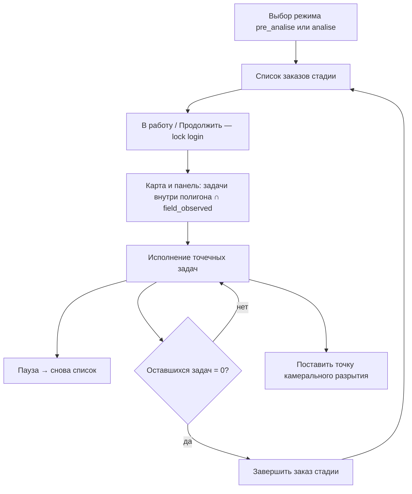

# Рабочие процессы роли `office` (MONITOR WebCRM → QGIS)

**Аудитория:** разработчик QGIS-плагина  
**Версия:** 2026-08-12  
**Назначение:** описать **что делает оператор с ролью `office`** в WebCRM, чтобы плагин повторил те же сценарии поверх БД `monitor` (и HTTP API писем).  
**Канон поведения:** фронтенд WebCRM (`frontend/src/App.tsx`, `TaskEditModal`, `OfficeWorkModeModal`) + права в `backend/app/auth/session.py`.

Смежные документы:

| Документ | Когда читать |
| -------- | ------------ |
| [qgis_module_data_contract.md](qgis_module_data_contract.md) | SQL, таблицы, операции P*/W*/O1, инварианты |
| [qgis_letters_api.md](qgis_letters_api.md) | HTTP API писем ОАТИ (Bearer JWT) |

---

## 1. Кто такой `office`

Офисный оператор — основной «камеральный» пользователь CRM:

- работает по **закреплённым районам** (`work_zones` → `odh_export.hood.gid`);
- **собирает** задачи района («Получить задачу»);
- **исполняет** точечные задачи: связи, станции, поле, закрытия, отложение;
- ведёт **площадные заказы** по стадиям **подготовка данных** / **анализ полевых данных**;
- при подготовке и анализе может **ставить точку камерального разрытия** на карте;
- формирует **письма ОАТИ**;
- **не** управляет персоналом и **не** создаёт пользователей.

Default-вкладка после входа: **`active`** («Активные»).

---

## 2. Права роли `office` (паритет с WebCRM)

| Возможность | `office` | Комментарий для QGIS |
| ----------- | -------- | -------------------- |
| Источники задач | `active`, `field`, `delay`, `done_legal`, `done_illegal`, `clear`, `area` | Все вкладки |
| Статусы area (полевое обследование) | `free`, `wip`, `done` | Полный набор |
| `can_collect` | ✓ | Кнопка «Получить задачу» |
| `can_postpone_tasks` | ✓ | Отложить + дата `delay_until` |
| `can_manage_field_task_status` | ✓ | Действия со статусом задач «В поле» |
| `can_generate_letters` | ✓ | Письма ОАТИ через HTTP API |
| `can_manage_personnel` | ✗ | Экран персонала скрыт |
| `can_create_users` | ✗ | Только admin |
| Ограничение районов | по `work_zones` | Admin видит все; office — только свои |

После login плагин должен сохранить флаги сессии и **не показывать** UI, на который флаг = false.

---

## 3. Карта экранов оператора

```text
Login
  └─ Модалка «Режим работы»          ← только office в WebCRM
        ├─ Подготовка данных в поле  → stage pre_analise
        ├─ Анализ полевых данных     → stage analise
        └─ К карте                   → обычный районный режим
              │
              ├─ Выбор района + «Получить задачу»
              ├─ Фильтр источников (active/field/…) + «Заказы»
              ├─ Панель задач + карта
              ├─ «Исполнить задачу» (карточка)
              ├─ Полевые материалы / фото
              └─ Письмо ОАТИ (при наличии отчёта)
```

В WebCRM модалка режимов показывается **только** `office` (не manager). Для паритета QGIS: **для `office` модалка обязательна**; manager работает в обычном районном режиме без модалки.

---

## 4. Сквозные процессы

### 4.1. Вход и сессия

1. Логин/пароль из `crm.users`.
2. Проверить `role === "office"` и флаги из §2.
3. Ограничить список районов `work_zones`.
4. Показать модалку «Режим работы» (§4.2) **до** карты.

Ошибки: неверный пароль / истекшая сессия → повторный вход. Для писем — Bearer JWT (см. letters API).

### 4.2. Выбор режима работы

| Кнопка в UI | Внутренний mode | Что дальше |
| ----------- | --------------- | ---------- |
| Подготовка данных в поле | `pre_analise` | Список площадных заказов стадии → взять в работу |
| Анализ полевых данных | `analise` | То же для стадии анализа |
| К карте | `map` | Обычный район: выбор района, сбор задач; стадии можно стартовать позже кнопками |

«Сменить режим» сбрасывает выбранный заказ/stage и снова открывает модалку.

### 4.3. Районный режим («К карте»)

Типичный день без lock стадии:

```text
Выбрать район
  → «Получить задачу» (загрузка существующих crm.tasks в полигоне района)
  → Фильтр: Активные / В поле / Отложено / Закрыто* / Разрытие отсутствует / Заказы
  → Выбрать объект в панели или на карте
  → «Исполнить» → карточка задачи (§5)
```

Важно:

- клиент **не создаёт** ордерные/фото-задачи — их пишет ETL MONITOR;
- «Получить задачу» = SELECT + JOIN по уже существующим `crm.tasks.key`;
- перед чтением active/delay — восстановить просроченные отложения (`delay_until <= сегодня MSK`).

### 4.4. Режим стадии площадного заказа (`pre_analise` / `analise`)

Это **главный** офисный процесс.



#### Отбор заказов в список

Показать `crm.tasks_area`, у которых **внутри geom** есть хотя бы одна **active** точечная задача:

| Stage | Фильтр точечных | Смысл |
| ----- | --------------- | ----- |
| `pre_analise` | `field_observed` **не** true | Подготовить и отправить в поле необследованное |
| `analise` | `field_observed` = true | Разобрать обследованное: отчёты, закрытия, точки |

В таблице: номер, площадь, дата, статус стадии (`idle` / `В работе (login)` / `Приостановлен` / `Подготовлен|Обработан`).

Кнопка «В работу» / «Продолжить» (`canStartStage`):

- `idle` — любой office;
- `paused` / `in_progress` — **только** тот же `*_started_by`;
- `done` — нельзя.

#### Пока заказ в работе

1. Start стадии → lock текущего login.
2. Подставить район заказа, загрузить active, отфильтровать UI/карту по полигону и `field_observed`.
3. Пока заказ не выбран — карта и список точечных задач **пустые**.
4. Показать счётчик оставшихся задач стадии в полигоне.
5. **Пауза** — снять рабочий заказ, вернуться к списку; resume только тем же login.
6. **Завершить** — только если remaining = 0 и заказ не на паузе.

#### Специфика стадий

| | `pre_analise` | `analise` |
| --- | --- | --- |
| Фокус | дозаполнить связи → **отправить в поле** | материалы поля → закрытия legal/illegal/clear |
| Создание office-точки | **разрешено** (O1), lock `pre_analise` текущего login | **разрешено** (O1), lock `analise` текущего login |
| Prefill связей с ордера | из карточки ордера можно стартовать place-point | из карточки ордера можно стартовать place-point |

Суточный reset lock по календарю **Europe/Moscow** обязателен до показа списка / start (иначе «залипшие» заказы). Детали — §5.5.6 / P4–P9 в data contract.

---

## 5. Исполнение точечной задачи (карточка)

Открывается из панели или карты. Для `active` — редактирование; для остальных источников — в основном просмотр + разрешённые статус-действия.

### 5.1. Что правит оператор

1. **Сопоставление (link)** — business id (`oati_id`, `earthwork_id`, …) вручную или pick объекта на карте.
2. **Станции** — `sps` / `kgs` / `station_avr`.
3. **Сохранить** → `UPDATE crm.tasks` по `key` + audit.

Для закрытия «законно» UI требует: хотя бы одно link-поле (кроме третьего в группе, если не ордера) **и** хотя бы одно поле станции.

### 5.2. Статус-действия (workflow)

| Действие | Откуда обычно | Куда / эффект | Условия для office |
| -------- | ------------- | ------------- | ------------------ |
| Отправить в поле | `active` (или `delay`) | snapshot field + `office_comment` | район сессии; задача в текущей выдаче |
| Закрыть законно | `active` / `field` | `done_legal` | валидация link+станции |
| Закрыть незаконно | `active` / `field` | `done_illegal` | нельзя, если `field_observed === false` |
| Разрытие отсутствует | `active` / `field` | `clear` | — |
| Вернуть в активные | `field` / `delay` | снять snapshot → снова active | — |
| Отложить | `active` / `field` | `delay` + `delay_until` (строго будущее) | `can_postpone_tasks` |

Комментарий офиса (`office_comment`) передаётся при отправке в поле.

### 5.3. Материалы и письма

- Если `field_observed` — доступны **полевые отчёты** (`mggt_field.reports`) и галерея фото (чтение).
- AI/фото-задачи: просмотр фото по `photo_uuid`.
- **Письмо ОАТИ:** при наличии отчёта с геометрией — draft → правка → generate DOCX через HTTP API WebCRM (не SQL). См. [qgis_letters_api.md](qgis_letters_api.md).

### 5.4. Создание точки камерального анализа

Доступно, когда:

- роль **office**: есть **рабочий** площадной заказ на стадии **`pre_analise` или `analise`** (active lock текущего login);
- роль **manager** (WebCRM): обычный районный режим без модалки стадий; по клику backend сам находит `tasks_area` по `ST_Contains` (без stage-lock);
- режим place-point на карте **или** кнопка из карточки ордера с prefill.

Шаги:

1. Клик Point внутри подходящего `tasks_area.geom` (для office — полигон рабочего заказа).
2. `INSERT crm.tasks` с `is_office_task = true` + `crm.office_task_points`.
3. Опционально prefill link-колонок с ордера.
4. Точка вне полигона / без lock (office) / чужой lock → ошибка.

Это **единственный** штатный клиентский create строки `crm.tasks` у офиса.

---

## 6. Работа с источниками задач

| Источник | UI-смысл | Что делает office |
| -------- | -------- | ----------------- |
| `active` | Не в snapshot | Основная обработка, отправка в поле, закрытия, отложение |
| `field` | В поле у исполнителя | Просмотр; смена статуса (вернуть / закрыть / отложить); материалы; письмо |
| `delay` | Отложено до даты | Вернуть в active / снова в поле |
| `done_legal` / `done_illegal` | Закрыто | Просмотр |
| `clear` | Разрытие отсутствует | Просмотр |
| `area` | Площадные заказы | Survey free/wip/done; карточка заказа; в stage-режиме — lock-процесс §4.4 |

Переключатель «Заказы» показывает полигоны area на карте параллельно точечному фильтру.

---

## 7. Что office **не** делает

Плагин **не должен** открывать эти сценарии под ролью `office`:

- управление пользователями / work_zones / bulk assign executor (это manager/admin);
- создание ордеров, фото-задач, ETL-объектов «с нуля» (только ETL + office-point);
- обход lock стадии или complete при remaining > 0;
- генерацию DOCX локально в QGIS (использовать API WebCRM).

---

## 8. Чеклист паритета QGIS для `office`

### Сессия и навигация

- [ ] Login, `work_zones`, флаги прав.
- [ ] Модалка режимов: pre_analise / analise / map.
- [ ] «Сменить режим» сбрасывает stage и заказ.

### Район и задачи

- [ ] Выбор района → «Получить задачу» без bulk INSERT.
- [ ] Все источники §6 + фильтр «Заказы».
- [ ] Restore просроченных delay перед загрузкой.
- [ ] Карточка: link, pick на карте, станции, save + audit.

### Workflow

- [ ] В поле (+ office_comment), legal, illegal (с проверкой field_observed), clear, return active, postpone.
- [ ] Полевые отчёты/фото; письмо ОАТИ по API.

### Площадные стадии

- [ ] Список заказов с фильтром active∩area∩field_observed.
- [ ] Start / pause / complete, lock одного login, conflict UI.
- [ ] Фильтр карты/панели; empty state до выбора заказа; счётчик remaining.
- [ ] Complete disabled при remaining > 0.
- [ ] Office-point под pre_analise- или analise-lock + точка в полигоне (office); manager — без lock, resolve по полигону.
- [ ] Суточный MSK reset lock.

### Негативные кейсы

- [ ] Район вне work_zones → отказ.
- [ ] Чужой lock → conflict.
- [ ] Point вне полигона / без analise → ошибка.
- [ ] Illegal при `field_observed === false` → недоступно.

---

## 9. Ориентиры в коде WebCRM

| Тема | Файлы |
| ---- | ----- |
| Права роли | `backend/app/auth/session.py`, `deps.py` |
| Модалка режимов / оркестрация | `frontend/src/App.tsx`, `OfficeWorkModeModal.tsx`, `AreaOrderPickerModal.tsx` |
| Фильтр задач по полигону и stage | `frontend/src/lib/filterTasksByArea.ts` |
| Карточка задачи / статусы | `frontend/src/components/TaskEditModal.tsx` |
| Создание office-точки | `backend/app/crm/office_tasks.py`, `POST /api/tasks/office` |
| Загрузка office_data | `backend/app/crm/office_data_loader.py` |
| Стадии area | `backend/app/crm/tasks_area.py` |
| Workflow snapshot | `backend/app/crm/store.py` |
| Письма | `backend/app/routes/letters.py` + [qgis_letters_api.md](qgis_letters_api.md) |

---

## См. также

- Полный data/SQL контракт: [qgis_module_data_contract.md](qgis_module_data_contract.md)  
- Письма ОАТИ: [qgis_letters_api.md](qgis_letters_api.md)
