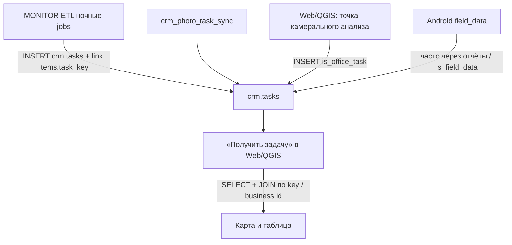
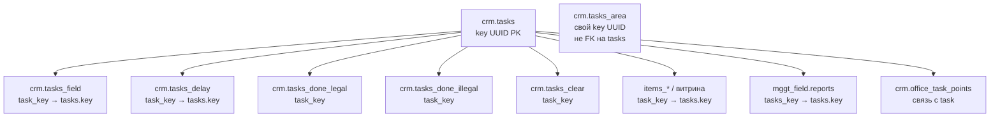

# Спецификация данных и поведения для нового модуля QGIS (MONITOR CRM)

**Версия:** 2026-08-10 (rev.4)  
**Аудитория:** разработчик QGIS-плагина, **не знакомый** с WebCRM / MONITOR  
**Цель:** полностью повторить операторский функционал MONITOR WebCRM поверх общей БД `monitor`  
**Канон:** репозиторий `MONITOR_WEBCRM` + схема `crm` / витрина MONITOR  
**Важно:** строки `crm.tasks` для ордеров/фото/разрытий **создаёт ETL MONITOR**, не клиент «Получить задачу».

---

## Как читать этот документ

1. §§1–3 — что за система и кто что пишет в БД.
2. §4 — модель данных и **граф связей через** `crm.tasks.key` (включая **§4.6 — `mggt_field.reports`**).
3. §5 — сценарии пользователя (что должен уметь UI плагина; **§5.5 — режимы pre_analise / analise**).
4. §6 — каталог операций с данными (что делать SQL-ом; **§6.3a — reports/photos**, **§6.6 — area locks**).
5. §§7–10 — права, инварианты, smoke, карта файлов WebCRM.

Ориентиры в коде WebCRM (не копировать HTTP — копировать **семантику SQL**):


| Тема                              | Файлы                                                                                                  |
| --------------------------------- | ------------------------------------------------------------------------------------------------------ |
| Роли                              | `backend/app/auth/session.py`                                                                          |
| «Получить задачу» (загрузка)      | `backend/app/crm/collector.py`, `etl_photo_loader.py`, `field_data_loader.py`, `office_data_loader.py` |
| Полевые отчёты / фото             | `backend/app/crm/field_data_loader.py`, `backend/app/photos/field_photo.py`, UI `FieldMaterialsModal.tsx` |
| Переходы статусов                 | `backend/app/crm/store.py`                                                                             |
| Площадные / pre_analise / analise | `backend/app/crm/tasks_area.py`                                                                        |
| Персонал                          | `backend/app/crm/personnel.py`                                                                         |
| Конфиг                            | `shared/layers_config.json`                                                                            |
| ETL создания задач                | репозиторий **MONITOR**: `collector/crm_task_sync.py`, `crm_photo_task_sync.py`                        |


---


## 1. Что это за продукт.


### 1.1. Экосистема


| Компонент                       | Роль                                                                                                                      |
| ------------------------------- | ------------------------------------------------------------------------------------------------------------------------- |
| **MONITOR (ETL + PostGIS)**     | Качает data.mos / genplan / lens, режет геометрии, **создаёт и линкует** строки в `crm.tasks`, пишет `task_key` в items_* |
| **MONITOR M2M API**             | Приём фото/метаданных с Android (не UI оператора)                                                                         |
| **MONITOR WebCRM**              | Браузерный CRM: карта + задачи + персонал + статистика                                                                    |
| **MONITOR_QGIS (новый модуль)** | Тот же CRM в QGIS: **тот же смысл операций и те же таблицы**                                                              |
| **Android MGGT Field**          | Полевые отчёты/фото → БД; Web/QGIS их читают                                                                              |


Все клиенты (Web, QGIS, Android, ETL) работают с **одной** БД `monitor`. Задача, созданная ETL, видна и в Web, и в QGIS. Статус, выставленный в QGIS, должен сразу отражаться в Web.

### 1.2. Что оператор делает руками

1. Входит (login/password из `crm.users`).
2. Выбирает **район** Москвы (`odh_export.hood`).
3. Нажимает **«Получить задачу»** (или грузит snapshot «В поле») — видит объекты района, уже заведённые как задачи.
4. **Исполняет** задачу: проставляет связи (link), станции, отправляет в поле / закрывает / откладывает.
5. Работает с **площадными заказами** (обследование, подготовка данных, анализ).
6. Manager/admin: персонал, назначение executor, статистика.


### 1.3. Кто создаёт задачи (критично)




| Источник строк в `crm.tasks`                  | Кто                                               | QGIS должен                                                         |
| --------------------------------------------- | ------------------------------------------------- | ------------------------------------------------------------------- |
| Ордера ОАТИ, земляные, АВР, локальные ремонты | **ETL** `sync_crm_tasks_after_etl`                | **Только читать**, не INSERT при «Получить задачу»                  |
| Фото AI / Lens (разрытия)                     | **ETL** photo sync (`source: etl_sync` в конфиге) | **Только читать**                                                   |
| ОГХ-разрытия и пр. витринные                  | **ETL** (целевая модель)                          | **Только читать**                                                   |
| Точка «камеральный анализ»                    | Клиент (`create_office_task`)                     | **Может INSERT** (единственный штатный клиентский create для офиса) |
| Полевые данные (`is_field_data`)              | Полевой контур / отчёты                           | Читать; создание — по контракту field/mobile, не «collect слоёв»    |


> **Устаревшая модель:** клиентский `persist_district_tasks` / `INSERT ... SELECT` из слоёв при collect. В коде WebCRM путь ещё может существовать как наследие, но **для нового QGIS-модуля его повторять нельзя**. «Получить задачу» = загрузка уже существующих `crm.tasks` по району и отрисовка геометрии.

---


## 2. Принципы совместимости

1. Одна БД `monitor`, прямой доступ из QGIS (pg_service / URI). HTTP WebCRM **не нужен для CRM-операций**. **Исключение:** формирование писем ОАТИ (DOCX) — через HTTP API WebCRM, см. [qgis_letters_api.md](qgis_letters_api.md).
2. Общий `shared/layers_config.json` (слои карты + `crm_tasks` / `task_store`).
3. Statistics v2 — **триггеры PostgreSQL**. Клиент только корректно меняет бизнес-таблицы и audit.
4. Audit: `user_created` / `user_last_edit` = `TEXT[]` вида `{login, 2026-08-10T06:00:00+00:00}`.
5. Не делать массовый `DELETE FROM crm.tasks`.
6. Паритет ролей с `auth/session.py`.
7. Центральный идентификатор задачи — `crm.tasks.key` **(UUID)**. Все статусы и связи идут через него.

---


## 3. Подключение и сессия


| Параметр     | Значение                                                                        |
| ------------ | ------------------------------------------------------------------------------- |
| БД           | `monitor`                                                                       |
| Пользователи | `crm.users`                                                                     |
| Пароль       | `WHERE login = $1 AND password = crypt($2, password)` (`pgcrypto`)              |
| Роли         | `field`                                                                         |
| Районы       | `work_zones INTEGER[]` = `odh_export.hood.gid`; у admin часто `{}` = все районы |


После логина сессия плагина должна хранить: `uuid`, `login`, `role`, `work_zones` и фильтровать все запросы по району.

Список районов:

```sql
SELECT gid, rayon FROM odh_export.hood
WHERE /* admin: без фильтра; иначе: gid = ANY(:work_zones) */
ORDER BY rayon;
```

Имена районов нормализовать так же, как WebCRM (`normalize_rayon_name`).

---


## 4. Модель данных и связи через `key`


### 4.1. Хаб: `crm.tasks.key`




**Правила:**

1. `crm.tasks.key` — первичный ключ задачи (UUID). В UI/API это же значение часто называют `task_key`.
2. Любая snapshot-таблица (`tasks_field`, `tasks_delay`, `tasks_done_*`, `tasks_clear`) хранит `task_key UUID NOT NULL REFERENCES crm.tasks(key)`.
3. Строки витрины data.mos (split `items_*`) после ETL получают колонку `task_key` = `crm.tasks.key`. Геометрию для карты берут из витрины, задачу — из `crm.tasks`, связь — **равенство UUID**.
4. Полевые отчёты: `mggt_field.reports.tasks_key` (имя колонки с «s») → `crm.tasks.key`. Подробно — **§4.6**.
5. **Площадный заказ** живёт в `crm.tasks_area` со **своим** `key` (UUID заказа). Это **другая сущность**. Точечные задачи внутри полигона заказа фильтруются геометрически / бизнес-логикой, а не FK `tasks.key → area.key`.
6. Business-id колонки на `crm.tasks` (`oati_id`, `earthwork_id`, …) — **внешний смысл объекта** (часто `point:123`), уникальны partial index. Они нужны, чтобы найти строку задачи и её `key`, а дальше все операции — по `key`.

#### Как «найти задачу» по объекту на карте

1. Взять из feature атрибут источника (например `id` / `uuid` слоя) по `task_store.subgroups[].source_field`.
2. При необходимости сформировать scoped id: `{geometry_type}:{id}` если `scoped_geometry_id: true`.
3. Найти строку:

```sql
SELECT key, type, oati_id, earthwork_id, /* ... */ , user_created, user_last_edit
FROM crm.tasks
WHERE oati_id = :business_id   -- или earthwork_id / photo_uuid / ...
LIMIT 1;
```

1. Дальше везде использовать `key` (в коде WebCRM — `task_key` на feature).


#### Как понять «статус» задачи

Задача **активна**, если её `key` **нет** в `tasks_field`, `tasks_delay`, `tasks_done_`*, `tasks_clear` (логика `detect_task_workflow_status` / filter active).


| Если `key` есть в…       | Статус UI      |
| ------------------------ | -------------- |
| нигде из snapshot        | `active`       |
| `crm.tasks_field`        | `field`        |
| `crm.tasks_delay`        | `delay`        |
| `crm.tasks_done_legal`   | `done_legal`   |
| `crm.tasks_done_illegal` | `done_illegal` |
| `crm.tasks_clear`        | `clear`        |


Переход статуса = INSERT/DELETE в snapshot-таблицах **по** `task_key = crm.tasks.key`, а не UPDATE «status» на самой `crm.tasks` (у точечных задач отдельного status-поля нет).

### 4.2. Колонки `crm.tasks` (сжато)


| Группа        | Колонки                                                                                       |
| ------------- | --------------------------------------------------------------------------------------------- |
| PK            | `key UUID`                                                                                    |
| Тип группы    | `type` (имя CRM-группы из конфига, напр. «Новые ордера ОАТИ…»)                                |
| Business ids  | `oati_id`, `earthwork_id`, `localwork_id`, `avr_mos_id`, `photo_uuid`, `photo_lens`, `ogh_id` |
| Станции       | `sps`, `kgs`, `station_avr`                                                                   |
| Флаги         | `field_observed`, `is_field_data`, `is_office_task`                                           |
| Якорь витрины | `source_table`, `source_row_id`, `source_global_id`, `source_geom_hash`                       |
| Audit         | `user_created`, `user_last_edit` (`TEXT[]`)                                                   |


### 4.3. Snapshot-таблицы

Общий каркас (упрощённо): копия business/type-полей + `task_key` + `rayon` + audit.


| Таблица                            | Дополнительно                                                                                        |
| ---------------------------------- | ---------------------------------------------------------------------------------------------------- |
| `crm.tasks_field`                  | `executor`, `sent_at`, `office_comment`; **геометрии колонки нет** (sql/29) — рисовать через resolve |
| `crm.tasks_delay`                  | `delay_until date`                                                                                   |
| `crm.tasks_done_legal` / `illegal` | закрытие                                                                                             |
| `crm.tasks_clear`                  | «разрытие отсутствует»                                                                               |


Имена таблиц брать из `task_store` в `layers_config.json` (`field_table`, `delay_table`, …).

### 4.4. `crm.tasks_area`

Свой `key`, `status` (`free` / `wip` / `done` — полевое обследование), `executor`, `task_number`, `rayon`, `area`, `date_survey`, `geom`,  
плюс **две независимые офисные стадии** (не путать со `status`):


| Стадия UI                    | Флаг завершения     | Lock / audit-колонки                                                                                                      |
| ---------------------------- | ------------------- | ------------------------------------------------------------------------------------------------------------------------- |
| Подготовка данных (`pre_analise`) | `pre_analise bool` | `pre_analise_started_by/at`, `pre_analise_paused_by/at`, `pre_analise_finished_by/at`                                   |
| Анализ полевых данных (`analise`) | `analise bool`     | `analise_started_by/at`, `analise_paused_by/at`, `analise_finished_by/at`                                               |


Состояния стадии (как в WebCRM `*WorkflowStatus`):

| Состояние      | Условие                                                                 |
| -------------- | ----------------------------------------------------------------------- |
| `idle`         | флаг false и `*_started_at` IS NULL                                   |
| `in_progress`  | `*_started_at` задан, `*_paused_at` NULL, флаг false                   |
| `paused`       | `*_paused_at` задан, флаг false                                         |
| `done`         | флаг true (`pre_analise` / `analise`)                                   |

Стадии **ортогональны** полевому `status` и друг другу: заказ может быть `status=done` по обследованию и при этом ещё `pre_analise`/`analise` idle. Подробный UX — **§5.5**.

### 4.5. Конфиг subgroup → колонка business id

Из `shared/layers_config.json` → `crm_tasks.task_store.subgroups`:


| Подгруппа                         | `task_column` на `crm.tasks` | `source_field` на слое | Примечание                |
| --------------------------------- | ---------------------------- | ---------------------- | ------------------------- |
| Ордера ОАТИ                       | `oati_id`                    | `id`                   | `scoped_geometry_id`      |
| Уведомления на земляные работы    | `earthwork_id`               | `id`                   | scoped                    |
| Текущие локальные ремонты         | `localwork_id`               | `id`                   | scoped                    |
| Аварийно-восстановительные работы | `avr_mos_id`                 | `id`                   | scoped                    |
| Фото после обработки ИИ           | `photo_uuid`                 | `uuid`                 | ETL sync                  |
| Фото разрытий и строек            | `photo_lens`                 | `external_report_id`   | ETL sync                  |
| Разрытия из полигонов ОГХ         | `ogh_id`                     | `id`                   |                           |
| Полевые данные                    | —                            | source `field_data`    | через reports (§4.6)      |
| Задачи из камерального анализа    | —                            | source `office_data`   | `is_office_task` + points |


### 4.6. Просмотр объектов `mggt_field.reports`

Это **не** отдельный CRM-статус и не snapshot-таблица. Отчёты пишет **Android MGGT Field** в схему `mggt_field`; Web/QGIS их **только читают** и показывают оператору вместе с фото.

#### Связи (канон)

```text
crm.tasks.key  ──(UUID)──►  mggt_field.reports.tasks_key
                                 │
                                 ├─ reports.point     → геометрия отчёта на карте (трансформ в 4326)
                                 ├─ reports.task      → mggt_field.photos.task   (N фото на сессию)
                                 ├─ reports.photo     → photos.photo_key         (legacy: одно «гео»-фото)
                                 └─ reports.id        → scope UI / письмо ОАТИ (report_id)
```

Имена схемы/таблицы/колонок брать из конфига subgroup «Полевые данные» (`source: field_data`):

| Ключ конфига           | Значение по умолчанию |
| ---------------------- | --------------------- |
| `reports_schema`       | `mggt_field`          |
| `reports_table`        | `reports`             |
| `reports_tasks_key`    | `tasks_key`           |
| `reports_geometry`     | `point`               |

#### Два сценария в UI

**A. Подгруппа «Полевые данные» при «Получить задачу»**  
Задачи с `is_field_data = true` и `field_observed = true`, у которых есть report с ненулевой геометрией **в полигоне района**. Геометрия feature = `reports.point` (не витрина data.mos). Перед выборкой WebCRM может один раз проставить `is_field_data` (критерий: `field_observed`, все business-id колонки NULL, есть report с geom) — см. `mark_discovered_field_data_tasks` / `collect_field_data_tasks`.

**B. Материалы по уже открытой задаче (любой подгруппы)**  
Для текущего `crm.tasks.key`:

1. Список отчётов с геометрией → маркеры/линии на карте (`fieldReports` highlight).
2. Модалка «Полевые материалы»: комментарий, фото баннера, галерея; переключатель «Все материалы» / конкретный `report_id`.
3. Бейдж полевого сотрудника: из атрибутов report (`username`, `created_at` / дата).
4. Письмо ОАТИ (опционально 2-я очередь QGIS) привязано к выбранному `report_id`.

Образец API WebCRM (семантика для QGIS SQL):  
`GET /api/tasks/{key}/field-reports`, `GET /api/tasks/{key}/field-photos?report_id=…`,  
`GET /api/photos/field/{file}/image` (файл с диска/SFTP-кэша, не BLOB в БД).

#### Список отчётов задачи (MUST)

```sql
SELECT r.*,
       ST_AsGeoJSON(ST_Transform(r.point, 4326))::json AS geometry
FROM mggt_field.reports r
WHERE r.tasks_key = :task_key::uuid
  AND r.point IS NOT NULL;
```

В ответе UI нужны как минимум: `report_id = r.id`, `report_task = r.task`, `comment`, `photo_key = r.photo`, остальные атрибуты строки (кроме geom/`tasks_key`), GeoJSON geometry.

#### Фото к отчётам (MUST)

Канон: `reports.task = photos.task`. Legacy всегда union-ить: `reports.photo = photos.photo_key`.

- **Вся задача** (`report_id` не задан): все фото, чьи `photos.task` ∈ distinct `reports.task` по `tasks_key`, **плюс** legacy по `photo_key`.
- **Один отчёт** (`report_id`): если `task` уникален среди reports — все фото этой сессии; если несколько reports делят один `task` — баннеры сессии + legacy `photo_key` этого отчёта (не «чужие» гео-фото соседних точек).
- Сортировка показа: баннеры первыми, затем по `created_at` / `id`.
- Колонки фото: `id`, `file_path` (в UI — basename), `banner`, `created_at`, `taken_at`, `photo_key`, `username`.
- Путь к файлу: `field_photo_storage_dir` (часто `/opt/monitor/mggtfield_photo`) ± SFTP-кэш — как `read_field_photo`.

#### Чего не делать

- Не INSERT/UPDATE/DELETE в `mggt_field.reports` / `photos` из операторского CRM.
- Не путать `reports.task` (строковый id сессии Android) с `crm.tasks.key` (UUID) и с `reports.tasks_key`.
- Не считать «полевые данные» только слоем витрины — без JOIN на reports геометрии нет.


---


## 5. Функционал, который должен повторить QGIS (по экранам)

Ниже — продуктовый чеклист паритета с WebCRM. Каждому пункту соответствуют операции §6.

### 5.1. Вход и районы

- [ ] Логин/пароль, ошибки 401.  
- [ ] Список районов по `work_zones`.  
- [ ] Field не видит кнопку сбора слоёв; default вкладка «В поле».


### 5.2. «Получить задачу» (загрузка active)

- [ ] По выбранному району загрузить **уже существующие** `crm.tasks`, пересекающиеся с полигоном района (через геометрию витрины / JOIN по `task_key`).  
- [ ] Сгруппировать UI как в конфиге: группы → подгруппы → features.  
- [ ] На каждой feature выставить `task_key` **=** `crm.tasks.key`.  
- [ ] Скрыть задачи, чей `key` уже в field/delay/done/clear (filter sent).  
- [ ] Опциональный фильтр дат (lookback) — как в WebCRM; ETL-фото без date_field.  
- [ ] **Не делать bulk INSERT в** `crm.tasks` **из слоёв.**

Для подгрупп `source: etl_sync` — образец: `collect_etl_sync_subgroup_tasks` (JOIN `crm.tasks` + атрибуты слоя в районе).

### 5.3. Вкладки источников

- [ ] active / field / delay / done_legal / done_illegal / clear / area — по матрице ролей.  
- [ ] Field: фильтр executor.  
- [ ] Area: field только `wip`.  
- [ ] Перед чтением active/delay — restore просроченных delay (`delay_until <= today MSK`).


### 5.4. Исполнение задачи

- [ ] Форма полей (link + станции) по типу/subgroup.  
- [ ] Pick объекта на карте → запись business id в колонку задачи (`UPDATE crm.tasks ... WHERE key = :task_key`).  
- [ ] Отправить в поле / закрыть legal|illegal / clear / вернуть в active / **отложить**.  
- [ ] **Полевые отчёты (§4.6 / F1–F5):** для `task_key` загрузить `mggt_field.reports` с geom; отрисовать на карте; открыть материалы (комментарий + баннер + галерея); фильтр по `report_id`; отдать файлы фото с хранилища.


### 5.5. Площадные заказы и офисные режимы (`pre_analise` / `analise`)

#### 5.5.1. Базовый area (все роли с доступом к area)

- [ ] Список area по району / статусам survey (`free`/`wip`/`done`).  
- [ ] Смена survey-status (полевое обследование) — P1–P3.  
- [ ] Назначение executor, `task_number` (admin) — P10–P11.  
- [ ] Просмотр карточки заказа (номер, площадь, дата, статус анализа).

#### 5.5.2. Кто входит в офисный режим

В WebCRM модалка «Режим работы» показывается роли **`office`** (не manager/admin) **до** карты:

1. **Подготовка данных в поле** → stage `pre_analise`
2. **Анализ полевых данных** → stage `analise`
3. **К карте** → обычный районный сценарий (без lock стадии; со старта экрана района можно взять заказ в stage кнопками)

QGIS MUST: для роли office воспроизвести выбор ступени; для остальных ролей — area как обычный source.

#### 5.5.3. Отбор заказов в список стадии

Показать только те `crm.tasks_area`, у которых **внутри полигона** есть хотя бы одна **active** точечная задача с нужным `field_observed`:

| Stage          | Фильтр точечных задач внутри `geom` заказа      | Смысл для оператора                                      |
| -------------- | ----------------------------------------------- | -------------------------------------------------------- |
| `pre_analise`  | `field_observed` **не** true                    | Подготовить / отправить в поле то, что ещё не обследовано |
| `analise`      | `field_observed` = true                         | Разобрать уже обследованные (отчёты, закрытия, точки)    |

Алгоритм списка (как `loadStageOrders` + `orderHasStageTasks`):

1. Загрузить все area (или по work_zones) с geom и audit-колонками стадий.
2. Для каждого уникального `rayon` заказа — загрузить active tasks района (как §5.2).
3. Оставить заказ, если `count(filter by area ∩ field_observed)` > 0.
4. В таблице: номер, площадь, дата обследования, статус стадии (`idle` / `В работе (login)` / `Приостановлен` / `Подготовлен|Обработан`).
5. Кнопка «В работу» / «Продолжить» только если `canStartStage`: idle — любой; paused/in_progress — **только** `*_started_by = current login`; done — нельзя.

#### 5.5.4. Взятие заказа в работу (start / resume)

При выборе заказа клиент:

1. Вызывает **start** стадии (P4 / P7): пишет `*_started_by/at`, снимает pause при resume тем же login.
2. Подставляет район заказа, грузит active tasks.
3. Фильтрует UI/карту: `geometryInsideArea` ∧ `field_observed` по stage (§5.5.3).
4. Держит выбранный area как **рабочий полигон** (overlay); вкладки точечных задач работают **внутри** этого фильтра.
5. Пока заказ не выбран — карта/список точечных задач пустые (office awaiting order).

Коды ответа start (для UI): `updated` | `skipped` | `conflict` | `not_found`.  
`conflict` = заказ уже держит другой пользователь → показать ошибку и обновить список.

#### 5.5.5. Что делает оператор, пока заказ «в работе»

Общее для обеих стадий:

- [ ] Открывает точечные задачи из отфильтрованного списка / карты и исполняет обычный workflow (§5.4): link, станции, в поле, закрытия, отложить, field reports.
- [ ] Видит счётчик оставшихся active-задач стадии в полигоне (`officeRemainingCount`).
- [ ] **Пауза** (P5 / P8): пишет `*_paused_*`, снимает рабочий заказ, возвращает к списку стадии. Resume — снова start тем же login.
- [ ] **Завершить** (P6 / P9): доступно **только если** оставшихся задач стадии в полигоне = **0**; пишет флаг стадии = true + `*_finished_*`; нельзя при pause. После complete — снова список стадии.
- [ ] «Сменить режим» — сброс stage/заказа, снова модалка режимов.

Специфика **`pre_analise`**:

- Фокус: задачи **без** полевого обследования → типично дозаполнить связи и **отправить в поле** (W1), чтобы потом `field_observed` стал true после работы полевика/ETL.
- [ ] **Добавить разрытие на карте** (O1): как на `analise`, но требуется **активный `pre_analise`-lock** текущего login.

Специфика **`analise`**:

- Фокус: задачи **с** `field_observed` → просмотр field materials (§4.6), закрытия legal/illegal/clear, анализ.
- [ ] **Добавить разрытие на карте** (O1): клик точки **внутри** полигона рабочего `tasks_area`; INSERT `crm.tasks` (`is_office_task`) + `crm.office_task_points`; опциональный link-prefill с ордера (oati/earthwork/…). Требуется **активный `analise`-lock** текущего login (не pause, не done, не чужой).
- Из карточки ордера группы «Новые ордера…» можно стартовать place-point с prefill business id.

#### 5.5.6. Суточный reset lock (не «таймаут N минут»)

При чтении area / перед start вызывать очистку **по календарному дню Europe/Moscow** (`clear_stale_*_locks`):

- Завершённая вчера стадия (`flag=true`, finished/started date < today MSK) → сброс в `idle` (флаг false, audit cleared).
- Незавершённый вчерашний lock (`started_at` вчера, flag false) → снять started/paused (заказ снова idle для любого).

QGIS MUST вызывать ту же семантику до показа списка / start, иначе «залипшие» lock’и.

#### 5.5.7. Чеклист паритета office-stage

- [ ] Модалка режимов для office.  
- [ ] Список заказов с фильтром по active∩area∩field_observed.  
- [ ] Start / pause / complete с lock одного login.  
- [ ] Фильтр карты и панели на время работы.  
- [ ] Complete disabled при remaining > 0.  
- [ ] Office point при pre_analise\|analise-lock (office) или resolve по полигону (manager) + точка в полигоне.  
- [ ] Суточный MSK reset.  
- [ ] События статистики через триггеры (не руками).


### 5.6. Персонал (manager/admin)

- [ ] Users, work_zones, create user (admin).  
- [ ] Bulk assign / bulk status.


### 5.7. Статистика (желательный паритет)

- [ ] Чтение `crm.statistics` (события пишет БД).  
- [ ] Сводки field/office, geo, закрытия заказов — по желанию как WebCRM UI.


### 5.8. Не обязательно в первой очереди QGIS

- Письма ОАТИ DOCX — **не через SQL**, а через HTTP WebCRM (Bearer JWT). Контракт интеграции: [qgis_letters_api.md](qgis_letters_api.md).  
- Тайлы «Схема» МГГТ (данные CRM от подложки не зависят).  
- Экраны tracks / employee locations (можно 2-й очередью).

---


## 6. Каталог операций с данными


### 6.1. Auth и справочники


| #   | Действие         | SQL / логика                                                                                          |
| --- | ---------------- | ----------------------------------------------------------------------------------------------------- |
| A1  | Логин            | `SELECT uuid, login, role, work_zones FROM crm.users WHERE login=$1 AND password=crypt($2, password)` |
| A2  | Районы           | `odh_export.hood` + фильтр gid                                                                        |
| A3  | Конфиг слоёв/CRM | читать `layers_config.json`                                                                           |
| A4  | GeoJSON слоя     | `ST_AsGeoJSON` + bbox + `sql_filter` слоя + hood filter для не-admin                                  |


### 6.2. Загрузка задач района («Получить задачу») — **без создания**


| #   | Действие                         | Что делать                                                                                                                                                                  | Чего не делать                                           |
| --- | -------------------------------- | --------------------------------------------------------------------------------------------------------------------------------------------------------------------------- | -------------------------------------------------------- |
| L1  | Полигон района                   | WKT/geom из `odh_export.hood` по имени района                                                                                                                               |                                                          |
| L2  | Active tasks в районе            | Для каждой subgroup: найти `crm.tasks` с нужным `task_column`, у которых геометрия связанного объекта пересекает район **или** items.`task_key` = tasks.key и geom в районе | **Не INSERT tasks**                                      |
| L3  | Проставить `task_key` на feature | Всегда `crm.tasks.key`                                                                                                                                                      | Не подменять business id вместо key в snapshot-операциях |
| L4  | ETL-photo subgroup               | Как `etl_photo_loader`: JOIN tasks ↔ слой по photo_uuid/photo_lens                                                                                                          | Не persist                                               |
| L5  | field_data                       | Как §4.6 A / F1: JOIN `crm.tasks` ↔ `mggt_field.reports` по `tasks_key`, geom в районе, `is_field_data`                                                                      | Не invent business id                                    |
| L5b | office_data                      | Отдельный loader (`is_office_task` + points)                                                                                                                                |                                                          |
| L6  | Filter sent                      | Убрать features, чей key ∈ snapshot tables                                                                                                                                  |                                                          |
| L7  | field_observed                   | Обогатить флаг с tasks                                                                                                                                                      |                                                          |


**Псевдологика L2 для ордеров (идея):**

```text
для subgroup "Ордера ОАТИ":
  mapping: task_column=oati_id, scoped=true
  взять features слоя в районе
  для каждой feature:
    business_id = f"{geom_type}:{source_id}"
    SELECT key FROM crm.tasks WHERE oati_id = business_id
    если нет key — объект ещё не заведён ETL → не показывать как задачу
       (или показать read-only витрину без CRM-действий — продуктово лучше скрыть)
    иначе feature.task_key = key
  исключить key, уже лежащие в tasks_field/delay/done/clear
```


### 6.3. Исключение: создание office-точки


| #   | Действие                   | Запись                                                                                                                                                                   |
| --- | -------------------------- | ------------------------------------------------------------------------------------------------------------------------------------------------------------------------ |
| O1  | Создать камеральную задачу | **office**: активный lock `pre_analise` **или** `analise` текущего login на `area_task_key` (не pause/done/чужой); Point внутри этого `tasks_area.geom`. **manager/admin**: stage-lock не проверяется; `area_task_key` опционален — если не задан, резолв по `ST_Contains(geom, point)` (при нескольких — наименьший `area`, затем `key`). `INSERT crm.tasks (…, is_office_task=true)` + `crm.office_task_points`; опционально prefill `oati_id`/`earthwork_id`/`localwork_id`/`avr_mos_id`. |


Это **единственный** штатный сценарий, где клиент создаёт новую строку `crm.tasks` в операторском UI.

### 6.3a. Полевые отчёты и фото (`mggt_field`) — только чтение


| #   | Действие                         | Логика                                                                                                                                 |
| --- | -------------------------------- | -------------------------------------------------------------------------------------------------------------------------------------- |
| F1  | Собрать «Полевые данные»         | Опционально `mark is_field_data`; SELECT tasks ⋈ reports в районе (§4.6 A); `task_key = t.key`; geom из `reports.point`              |
| F2  | Список reports задачи            | `WHERE tasks_key = :key AND point IS NOT NULL` + GeoJSON 4326                                                                          |
| F3  | Фото всей задачи                 | photos по `task ∈ reports.task` ∪ legacy `photo_key = reports.photo`                                                                   |
| F4  | Фото одного report               | Scope по `report_id` + уникальность `task` (§4.6); иначе баннеры + legacy                                                              |
| F5  | Отдать файл изображения          | Basename `file_path` → локальный каталог / SFTP-кэш; не из PostGIS                                                                     |
| F6  | Карта / бейдж                    | Highlight всех report geometries; username/date из attributes report                                                                   |


QGIS **не обязан** ходить в HTTP WebCRM: достаточно того же SQL и доступа к каталогу фото (или прокси к уже закэшированным файлам).

### 6.4. PATCH задачи


| #   | Действие               | SQL                                                                               |
| --- | ---------------------- | --------------------------------------------------------------------------------- |
| U1  | Сохранить link/станции | `UPDATE crm.tasks SET oati_id/sps/..., user_last_edit=$audit WHERE key=$task_key` |
| U2  | Валидация перед полем  | обязательные link-поля по типу (как `validate_task_for_field_send`)               |


Всегда ключ в WHERE — `key`, не business id (business id может меняться формой).

### 6.5. Переходы workflow (точечные)

Всегда: найти `crm.tasks` по `key`, работать с snapshot через `task_key`.


| #   | Действие         | Из               | В            | Операции                                                                                                                    |
| --- | ---------------- | ---------------- | ------------ | --------------------------------------------------------------------------------------------------------------------------- |
| W1  | В поле           | active           | field        | `INSERT crm.tasks_field (task_key, type, …, rayon, audit)`                                                                  |
| W2  | Close legal      | →                | done_legal   | INSERT done_legal                                                                                                           |
| W3  | Close illegal    | →                | done_illegal | INSERT                                                                                                                      |
| W4  | Clear            | →                | clear        | INSERT tasks_clear                                                                                                          |
| W5  | Вернуть в active | field или delay  | active       | `DELETE FROM … WHERE task_key=$key`                                                                                         |
| W6  | Отложить         | active или field | delay        | если field — DELETE field **без** ложного return-stat; `INSERT tasks_delay (…, delay_until)` где `delay_until > today(MSK)` |
| W7  | Restore delay    | delay            | active       | `DELETE FROM crm.tasks_delay WHERE delay_until <= :today_msk`                                                               |
| W8  | Bulk status      |                  |              | пакет W1/W4/W5                                                                                                              |
| W9  | Bulk assign      | field/area       |              | `UPDATE … SET executor=$login WHERE task_key=…` / area.key                                                                  |


Права: postpone — office/manager/admin; field не postpone и не collect.

### 6.6. Площадные (`tasks_area`) — свой `key`


| #     | Действие                         | Данные / условие                                                                                                                                 | Триггер stats                      |
| ----- | -------------------------------- | ------------------------------------------------------------------------------------------------------------------------------------------------ | ---------------------------------- |
| P1    | На обследование                  | `status` free→wip                                                                                                                                |                                    |
| P2    | Снять                            | wip→free                                                                                                                                         |                                    |
| P3    | Завершить обследование           | wip / wip_field / in_pause → done                                                                                                                | `field_order_closed`               |
| P4    | Start / resume `pre_analise`     | idle: set `pre_analise_started_by/at`; paused: clear pause **только** если started_by=login; иначе conflict                                       | `office_pre_analise_started`       |
| P5    | Pause `pre_analise`              | set `pre_analise_paused_*` where started_by=login, not done, not already paused                                                                  | (pause в stats отдельно не пишется)|
| P6    | Complete `pre_analise`           | `pre_analise=true` + finished_*; **только** holder, не paused; UI ещё требует 0 remaining unobserved-in-polygon                                  | `office_pre_analise_completed`     |
| P7    | Start / resume `analise`         | зеркало P4 на колонках `analise_*`                                                                                                               | `office_analise_started`           |
| P8    | Pause `analise`                  | зеркало P5                                                                                                                                       |                                    |
| P9    | Complete `analise`               | `analise=true` + finished_*; UI: 0 remaining observed-in-polygon                                                                                 | `office_analise_completed`         |
| P10   | task_number                      | UPDATE                                                                                                                                           | admin only                         |
| P11   | executor area                    | UPDATE                                                                                                                                           |                                    |
| P12   | Stale lock reset (MSK day)       | `clear_stale_pre_analise_locks` / `clear_stale_analise_locks` перед list/start                                                                   | может обнулить вчерашний done/lock |


**Lock (MUST):**

- Одновременно одну стадию одного заказа держит один `*_started_by`.
- Pause не передаёт заказ другому: resume только holder.
- Complete с paused запрещён (сначала resume или оставить на паузе без complete).
- `pre_analise` и `analise` — **раздельные** lock’и (можно теоретически иметь историю обеих; в UI office берёт одну ступень за сессию).
- Перед list/start — P12 (сутки MSK), не произвольный TTL.

Код: `backend/app/crm/tasks_area.py`, UI-оркестрация `frontend/src/App.tsx` + `AreaOrderPickerModal` / `OfficeWorkModeModal`.

### 6.7. Персонал


| #     | Действие                                                  |
| ----- | --------------------------------------------------------- |
| H1    | Список `crm.users`                                        |
| H2    | `UPDATE work_zones`                                       |
| H3    | `INSERT` user + `crypt(password, gen_salt('bf'))` — admin |
| H4–H5 | assign / bulk                                             |


### 6.8. Статистика (чтение)


| #     | Действие                                                                          |
| ----- | --------------------------------------------------------------------------------- |
| S1–S4 | SELECT из `crm.statistics` (+ join area для га). Коды — `statistics/technical.md` |


---


## 7. Матрица прав (паритет)


| Source         | admin        | manager | office | field      |
| -------------- | ------------ | ------- | ------ | ---------- |
| active         | ✓            | ✓       | ✓      | —          |
| field          | ✓            | ✓       | ✓      | ✓          |
| delay          | ✓            | ✓       | ✓      | —          |
| done_* / clear | ✓            | ✓       | ✓      | —          |
| area           | all statuses | all     | all    | только wip |


| Флаг                                       | Роли                   |
| ------------------------------------------ | ---------------------- |
| can_collect (кнопка загрузки задач района) | ¬field                 |
| can_postpone_tasks                         | office, manager, admin |
| can_manage_personnel                       | manager, admin         |
| can_manage_field_task_status               | office, manager, admin |
| can_create_users                           | admin                  |


Field: `executor = me OR executor IS NULL` на `tasks_field`.

---


## 8. Инварианты

1. Операции статусов — только по `crm.tasks.key` **/** `task_key`.
2. Не создавать ордерные/фото задачи из клиента — только ETL (+ office point).
3. Не дублировать `task_key` в одной snapshot-таблице.
4. Active = отсутствует во всех snapshot.
5. `delay_until` строго в будущем при postpone.
6. Писать audit на изменения.
7. Не обходить триггеры статистики.
8. Scoped business id: разные геометрии одного raw id — разные задачи.
9. Согласовывать `layers_config.json` с WebCRM и MONITOR ETL.
10. Офисные стадии: lock одного login; complete только без pause и (в UI) при remaining=0; O1 для office под `pre_analise`\|`analise`-lock; manager/admin — resolve по полигону без lock.

---


## 9. Smoke для приёмки плагина

1. Логин всех ролей — вкладки и районы верны.
2. «Получить задачу» показывает задачи с непустым `task_key`; **число** `crm.tasks` **не растёт** от этой кнопки.
3. Клик → исполнение → send-to-field → строка в `tasks_field` с тем же `task_key`.
4. Postpone → `tasks_delay`; restore возвращает в active.
5. Field видит только свои/NULL executor.
6. Area done полевым → событие в `crm.statistics`.
7. pre_analise: список только заказов с unobserved active в полигоне → start → фильтр карты → send-to-field уменьшает remaining → complete при 0; чужой login получает conflict.
8. analise: список observed → start → materials/закрытия → office point внутри полигона OK, снаружи / без lock — ошибка → complete при 0.
9. Пауза → заказ не у другого; на следующий день MSK вчерашний lock сброшен.
10. Задача из Web видна в QGIS и наоборот.
11. Office point create → новый `crm.tasks.key` с `is_office_task` (pre_analise или analise; manager — без lock, resolve по полигону).
12. Нет всплеска в `crm.tasks_deletion_log`.
13. Задача с `mggt_field.reports`: на карте видны точки/линии отчётов; материалы показывают комментарий и фото; смена `report_id` сужает набор фото.

---


## 10. Рекомендуемый порядок разработки модуля

1. Подключение к БД, login, hood, чтение конфига, отрисовка слоёв.
2. Резолв `key`: feature ↔ `crm.tasks` по business id / items.task_key.
3. Загрузка active/field/area **без INSERT tasks**.
4. Workflow W1–W7 + audit.
5. Area P1–P12 + офисный UX §5.5 (режимы, фильтр field_observed, remaining→complete).
6. Office point O1 (после analise-lock).
7. **Полевые отчёты F1–F5** (карта + материалы + файлы фото).
8. Personnel.
9. Статистика (read).
10. Вырезать любой legacy «создать задачи из слоя при collect».

---


## 11. Частые ошибки новичка


| Ошибка                                            | Как правильно                           |
| ------------------------------------------------- | --------------------------------------- |
| При «Получить задачу» делать INSERT в `crm.tasks` | Только SELECT/JOIN; создание — ETL      |
| В snapshot писать business id вместо UUID         | Писать `task_key = crm.tasks.key`       |
| Хранить «статус» колонкой на tasks                | Статус = наличие key в snapshot-таблице |
| Путать `tasks_area.key` и `tasks.key`             | Разные сущности                         |
| Рисовать field из `tasks_field.geom`              | Geom дропнут; resolve из витрины по key |
| Писать в `crm.statistics` вручную                 | Менять бизнес-таблицы → триггеры        |
| Искать фото только по `reports.photo`             | Канон — `reports.task` = `photos.task`; photo — legacy |
| Путать `reports.task` и `crm.tasks.key`           | `tasks_key` = UUID задачи; `task` = сессия Android |
| Рисовать «Полевые данные» без JOIN на reports     | Геометрия задачи — из `reports.point`   |
| Путать survey `status` и стадии pre_analise/analise | Разные колонки; стадии независимы     |
| Фильтровать stage только по флагу `analise` на area | Список заказов — по active∩geom∩field_observed |
| Complete при remaining > 0                        | Кнопка disabled, пока в полигоне есть задачи стадии |
| Office point вне полигона / без lock у office     | O1: office — lock `pre_analise`\|`analise`; manager — resolve по `ST_Contains` |
| Сбрасывать lock по «N минут»                      | Сброс по календарному дню Europe/Moscow |


---


## См. также

- Рабочие процессы роли `office`: [office_role_workflows.md](office_role_workflows.md)  
- Письма ОАТИ (HTTP API для плагина): [qgis_letters_api.md](qgis_letters_api.md)  
- Vault: `Projects/MONITOR WebCRM/14 — Спецификация данных для QGIS-модуля.md`  
- Changelog WebCRM: `Projects/MONITOR WebCRM/13 — Нововведения (changelog).md`  
- ETL CRM sync: документация MONITOR `10 — CRM и WebCRM`  
- Статистика: `statistics/technical.md`

