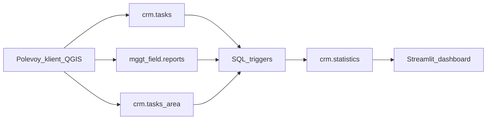
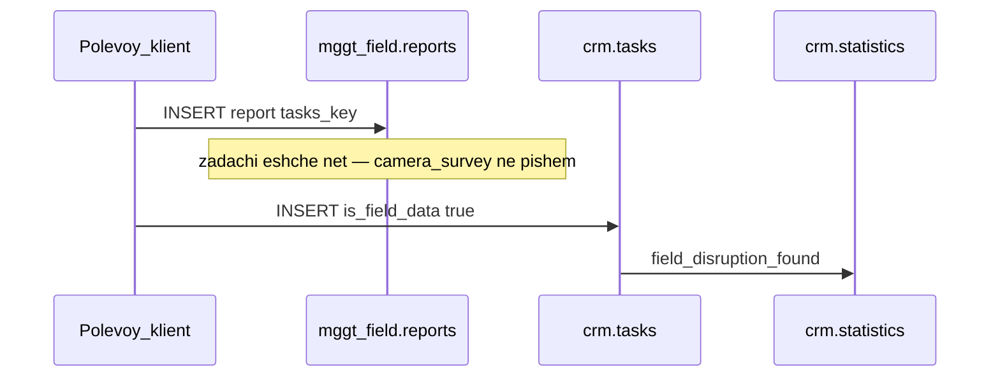

# Статистика WebCRM для Streamlit-дашборда

Справочник для разработчика, который строит отдельный дашборд (Streamlit) по тем же данным, что экран **Статистика** в MONITOR WebCRM.

Целевая база: PostgreSQL/PostGIS `monitor` на проде **172.21.198.219** (Docker `monitor-db`, пользователь `monitor`). Это та же схема `crm`, которой пользуются WebCRM и QGIS.

Дашборд должен **только читать**. Не писать в `crm.tasks`, `crm.tasks_field`, `crm.tasks_clear`, `crm.tasks_done_legal`, `crm.tasks_done_illegal`, `crm.tasks_area`. Скрипты из `sql/one_time/` не запускать.

---

## 1. Откуда берутся цифры

WebCRM **не считает** статистику на лету из `crm.tasks` и не делает `COUNT(*) WHERE is_field_data`.

Экран «Статистика» читает уже записанные **факты** из таблицы `crm.statistics`. Каждая строка — одно действие одного сотрудника над одним объектом в конкретный момент.

Строки появляются из **SQL-триггеров** (QGIS и полевой клиент пишут в те же таблицы, триггеры срабатывают в БД):

| Файл | Что делает |
|------|------------|
| [`sql/12_crm_statistics.sql`](../sql/12_crm_statistics.sql) | таблица, `statistics_insert_row`, маппинг ролей |
| [`sql/15_statistics_v2.sql`](../sql/15_statistics_v2.sql) | каталог событий v2 и основные триггеры |
| [`sql/31_statistics_pre_analise.sql`](../sql/31_statistics_pre_analise.sql) | pre-analise офиса |
| [`sql/37_statistics_order_closed_statuses.sql`](../sql/37_statistics_order_closed_statuses.sql) | закрытие заказа из `wip_field` / `in_pause` |
| [`sql/42_statistics_field_disruption_found.sql`](../sql/42_statistics_field_disruption_found.sql) | обнаружение разрытия без окна ±5 минут |

Python [`backend/app/crm/statistics.py`](../backend/app/crm/statistics.py) только **агрегирует** уже существующие строки. Дашборд должен делать то же: `SELECT` из `crm.statistics` + JOIN к справочникам.



---

## 2. Схема `crm.statistics`

```sql
SELECT
    id,            -- bigserial
    user_id,       -- uuid, crm.users.uuid, может быть NULL
    user_login,    -- text, логин как в crm.users.login
    user_role,     -- 'field' | 'office'  (manager/admin пишутся как office)
    object_type,   -- 'task' | 'order'
    action,        -- код события, см. каталог ниже
    object_key,    -- uuid: crm.tasks.key или crm.tasks_area.key
    created_at,    -- timestamptz, время события
    metadata       -- jsonb, обычно {source, via, rayon, ...}
FROM crm.statistics;
```

Индексы: `(user_login, created_at DESC)`, `(object_type, action, created_at DESC)`, `(object_type, object_key, action)`.

### Идемпотентность

`crm.statistics_insert_row` **не вставляет** вторую строку с той же тройкой:

```text
(object_type, object_key, action)
```

Повтор того же действия по тому же объекту (повторный отчёт, повторный sync) статистику не увеличивает. Считать `COUNT(*)` по строкам — это число **уникальных объектов**, на которых случилось действие, а не число кликов.

### Роли

Функция `crm.statistics_resolve_role(login)`:

| `crm.users.role` | в статистике |
|------------------|--------------|
| `field` | `field` |
| `office`, `manager`, `admin` | `office` |
| нет пользователя / иная роль | событие **не пишется** |

Логин без записи в `crm.users` (например тестовый `vasya`) в дашборде полевых сотрудников не появится.

### Период

В WebCRM границы периода — **UTC**:

```text
date_from  00:00:00+00
date_to    23:59:59.999999+00
```

Фильтр всегда по `s.created_at` (время события), **не** по `crm.tasks_area.date_survey`.

В UI по умолчанию последние **30 дней**. Для дашборда лучше дать явный date range; если смотреть «обнаружение разрытия», `created_at` часто равен `mggt_field.reports.created_at` (время съёмки на планшете), а не времени синка.

Площадь заказа в `crm.tasks_area.area` — **квадратные метры**. В UI и в запросах ниже — гектары: `area / 10000.0`.

---

## 3. Каталог событий

Русские подписи — как на экране статистики ([`frontend/src/lib/statisticsLabels.ts`](../frontend/src/lib/statisticsLabels.ts)).

### Полевые (`user_role = 'field'`)

| `action` | Подпись в UI | `object_type` | Когда появляется |
|----------|--------------|---------------|------------------|
| `field_camera_survey` | Обследование камеральной задачи | `task` | Отчёт по **уже существующей** задаче, которая не `is_field_data` и не в `tasks_clear`; либо `DELETE` из `crm.tasks_field` при наличии отчёта |
| `field_disruption_absent` | Отсутствие разрытия по задаче | `task` | Отчёт + строка в `crm.tasks_clear` (поле закрыло задачу как «разрытия нет») |
| `field_disruption_found` | Обнаружение разрытия в поле | `task` | Задача с `crm.tasks.is_field_data = true` **и** отчёт в `mggt_field.reports` с непустым `username` |
| `field_order_closed` | Закрытие заказа | `order` | `crm.tasks_area.status`: `wip` / `wip_field` / `in_pause` → `done`, `executor` — полевой |

Колонка «Обнаружение разрытия» на экране сотрудников — это `COUNT(*) FILTER (WHERE action = 'field_disruption_found')`.

### Офисные (`user_role = 'office'`)

| `action` | Подпись в UI | `object_type` | Когда появляется |
|----------|--------------|---------------|------------------|
| `office_pre_analise_started` | Подготовка данных начата | `order` | заполнен `tasks_area.pre_analise_started_at` |
| `office_pre_analise_completed` | Подготовка данных завершена | `order` | `pre_analise = true` или заполнен `pre_analise_finished_at` |
| `office_analise_started` | Анализ полевых данных начат | `order` | заполнен `analise_started_at` |
| `office_analise_completed` | Анализ полевых данных завершён | `order` | `analise = true` или заполнен `analise_finished_at` |
| `office_disruption_absent` | Разрытие отсутствует | `task` | INSERT в `crm.tasks_clear` **без** полевого отчёта в окне корреляции |
| `office_camera_tasks_created` | Создано камеральных задач | `task` | INSERT в `crm.tasks` с `is_office_task = true` и не `is_field_data` |
| `office_closed_illegal` | Закрыто нелегально | `task` | INSERT в `crm.tasks_done_illegal` |
| `office_closed_legal` | Закрыто легально | `task` | INSERT в `crm.tasks_done_legal` |

### Поток «поле обнаружило разрытие»

Полевой сотрудник рисует новое разрытие (не из выданной камеральной задачи):

1. Обычно сначала `INSERT mggt_field.reports` (`tasks_key` = uuid будущей задачи).
2. Затем `INSERT crm.tasks` с `is_field_data = true` (или позже `UPDATE is_field_data` false→true).

После [`sql/42`](../sql/42_statistics_field_disruption_found.sql):

- если отчёт пришёл **раньше** задачи — reports-триггер **не** пишет `field_camera_survey` (задачи ещё нет);
- когда появляется задача с `is_field_data` — пишется `field_disruption_found` **без** окна ±5 минут между `user_created` и `reports.created_at`;
- то же при `UPDATE is_field_data` с false на true.

До sql/42 отчёт без задачи классифицировался как `field_camera_survey`, а находка часто не писалась (окно 5 минут). Backfill в sql/42 это поправил в `crm.statistics`; живые события идут уже по новым триггерам.



Альтернатива: задача уже с `is_field_data`, потом отчёт — reports-триггер сразу пишет `field_disruption_found`.

---

## 4. Связанные таблицы (JOIN, не источник фактов)

Считать KPI **только** из `crm.statistics`. Таблицы ниже — подписи, площадь, география.

| Таблица | Зачем дашборду |
|---------|----------------|
| `crm.users` | `login`, `name`, `role` — ФИО в легенде |
| `crm.tasks_area` | заказ: `key`, `task_number`, `rayon`, `area` (м²), `status`, `executor` |
| `odh_export.hood` | район → округ: `rayon`, `okrug_shor`. Исключать округа `НАО` и `ТАО` |
| `mggt_field.tracks` | длительность обследования: `duration_sec`; колонка `task` иногда `area:<uuid>` |
| `crm.tasks` | объяснение `is_field_data` / `field_observed`. **Не** `COUNT` вместо статистики |
| `mggt_field.reports` | полевой отчёт: `tasks_key`, `username`, `created_at`, геометрия `point` |

Статусы заказа `crm.tasks_area.status`: `free`, `wip`, `wip_field`, `in_pause`, `done`.

Открытые заказы в территориальной вкладке WebCRM — **снимок сейчас** (`status IN ('free', 'wip')`), а не события за выбранный период.

---

## 5. Как устроен экран WebCRM (ориентир виджетов)

Файл: [`frontend/src/components/StatisticsScreen.tsx`](../frontend/src/components/StatisticsScreen.tsx). Три режима (manager/admin видят все):

### Сотрудники

Таблица полевых:

| Колонка UI | Поле API / SQL |
|------------|----------------|
| Сотрудник | `user_login` → `crm.users.name` |
| Обследование камеральной задачи | `camera_surveys` |
| Отсутствие разрытия | `disruption_absent` |
| Обнаружение разрытия | `disruption_found` |
| Закрытие заказа | `orders_closed` |
| Площадь закрытых, га | `orders_closed_ha` |

Офис: строки `(user_login, object_type, action, action_count, area_hectares)`.

Детализация по одному сотруднику (если выбран логин): закрытия и анализы — `field_order_closed`, `office_pre_analise_completed`, `office_analise_completed`, `office_closed_illegal`, `office_closed_legal`.

### Территория

Иерархия округ → район. Метрики: закрытые заказы и га, открытые заказы и га, завершённые pre-analise и analise, `%` прогресса (`closed_ha / (closed_ha + open_ha)`).

Фильтр «тип объекта = задача» для geo даёт **пустой** результат: территория считается только по заказам.

### Заказы

Лента `field_order_closed` с номером, районом, исполнителем, площадью, длительностью трека.

---

## 6. Готовые SQL для Streamlit

Подставьте `:date_from` и `:date_to` как `date` (включительно). Эквивалент границ WebCRM:

```sql
-- период как в WebCRM (UTC)
-- start = date_from::timestamp AT TIME ZONE 'UTC'
-- end   = (date_to + 1) AT TIME ZONE 'UTC' - interval '1 microsecond'
-- проще и достаточно для дашборда:
-- s.created_at >= :date_from::date
-- AND s.created_at <  (:date_to::date + 1)
```

Ниже используется полуинтервал `[date_from, date_to + 1 day)`.

### 6.1. Справочник сотрудников

```sql
SELECT uuid, login, name, role
FROM crm.users
WHERE role IN ('field', 'office', 'manager', 'admin')
ORDER BY name, login;
```

JOIN к агрегатам: `u.login = s.user_login`. Для подписи: `COALESCE(NULLIF(TRIM(u.name), ''), u.login)`.

### 6.2. Сводка полевых (вкладка «Сотрудники»)

```sql
SELECT
    s.user_login,
    COALESCE(NULLIF(TRIM(u.name), ''), s.user_login) AS display_name,
    COUNT(*) FILTER (WHERE s.action = 'field_camera_survey')     AS camera_surveys,
    COUNT(*) FILTER (WHERE s.action = 'field_disruption_absent') AS disruption_absent,
    COUNT(*) FILTER (WHERE s.action = 'field_disruption_found')  AS disruption_found,
    COUNT(*) FILTER (WHERE s.action = 'field_order_closed')      AS orders_closed,
    COALESCE(
        SUM(ta.area) FILTER (WHERE s.action = 'field_order_closed'),
        0
    ) / 10000.0 AS orders_closed_ha
FROM crm.statistics s
LEFT JOIN crm.users u
  ON u.login = s.user_login
LEFT JOIN crm.tasks_area ta
  ON s.object_type = 'order'
 AND s.object_key = ta.key
WHERE s.user_role = 'field'
  AND s.created_at >= :date_from::date
  AND s.created_at <  (:date_to::date + 1)
GROUP BY s.user_login, u.name
ORDER BY camera_surveys DESC, disruption_found DESC, orders_closed DESC;
```

### 6.3. Breakdown офиса

```sql
SELECT
    s.user_login,
    COALESCE(NULLIF(TRIM(u.name), ''), s.user_login) AS display_name,
    s.object_type,          -- task | order
    s.action,
    COUNT(*) AS action_count,
    COALESCE(SUM(ta.area), 0) / 10000.0 AS area_hectares
FROM crm.statistics s
LEFT JOIN crm.users u ON u.login = s.user_login
LEFT JOIN crm.tasks_area ta
  ON s.object_type = 'order'
 AND s.object_key = ta.key
WHERE s.user_role = 'office'
  AND s.created_at >= :date_from::date
  AND s.created_at <  (:date_to::date + 1)
  AND s.action IN (
      'office_pre_analise_started',
      'office_pre_analise_completed',
      'office_analise_started',
      'office_analise_completed',
      'office_disruption_absent',
      'office_camera_tasks_created',
      'office_closed_illegal',
      'office_closed_legal'
  )
GROUP BY s.user_login, u.name, s.object_type, s.action
ORDER BY s.user_login, s.action, s.object_type;
```

Для офисных **задач** площадь в UI показывают как «—» (`object_type = 'task'` → не суммировать га в карточках сотрудника).

### 6.4. Территория: район и округ

Закрытия и анализы — из событий за период. Открытые заказы — текущий снимок `free`/`wip`.

```sql
WITH hood AS (
    SELECT DISTINCT ON (rayon_norm)
        rayon_norm,
        NULLIF(TRIM(okrug_shor), '') AS okrug
    FROM (
        SELECT
            regexp_replace(TRIM(rayon::text), '\s+', ' ', 'g') AS rayon_norm,
            okrug_shor,
            gid
        FROM odh_export.hood
        WHERE rayon IS NOT NULL
          AND TRIM(rayon::text) <> ''
          AND TRIM(COALESCE(okrug_shor, '')) NOT IN ('НАО', 'ТАО')
    ) h
    ORDER BY rayon_norm, gid
),
events AS (
    SELECT
        s.action,
        ta.area,
        NULLIF(
            regexp_replace(
                TRIM(COALESCE(NULLIF(TRIM(ta.rayon), ''), s.metadata->>'rayon')),
                '\s+', ' ', 'g'
            ),
            ''
        ) AS rayon_norm
    FROM crm.statistics s
    LEFT JOIN crm.tasks_area ta ON s.object_key = ta.key
    WHERE s.created_at >= :date_from::date
      AND s.created_at <  (:date_to::date + 1)
      AND s.object_type = 'order'
      AND s.action IN (
          'field_order_closed',
          'office_pre_analise_completed',
          'office_pre_analise_started',
          'office_analise_completed',
          'office_analise_started'
      )
),
closed AS (
    SELECT
        rayon_norm,
        COUNT(*) FILTER (WHERE action = 'field_order_closed') AS orders_closed,
        COALESCE(SUM(area) FILTER (WHERE action = 'field_order_closed'), 0) / 10000.0 AS orders_closed_ha,
        COUNT(*) FILTER (WHERE action = 'office_pre_analise_completed') AS pre_analise_completed,
        COUNT(*) FILTER (WHERE action = 'office_analise_completed') AS analise_completed
    FROM events
    WHERE rayon_norm IS NOT NULL
    GROUP BY rayon_norm
),
open_orders AS (
    SELECT
        regexp_replace(TRIM(ta.rayon), '\s+', ' ', 'g') AS rayon_norm,
        COUNT(*) AS orders_open,
        COALESCE(SUM(ta.area), 0) / 10000.0 AS orders_open_ha
    FROM crm.tasks_area ta
    WHERE ta.status IN ('free', 'wip')
      AND NULLIF(TRIM(ta.rayon), '') IS NOT NULL
    GROUP BY 1
),
combined AS (
    SELECT
        COALESCE(c.rayon_norm, o.rayon_norm) AS rayon_norm,
        COALESCE(c.orders_closed, 0) AS orders_closed,
        COALESCE(c.orders_closed_ha, 0) AS orders_closed_ha,
        COALESCE(c.pre_analise_completed, 0) AS pre_analise_completed,
        COALESCE(c.analise_completed, 0) AS analise_completed,
        COALESCE(o.orders_open, 0) AS orders_open,
        COALESCE(o.orders_open_ha, 0) AS orders_open_ha
    FROM closed c
    FULL OUTER JOIN open_orders o ON c.rayon_norm = o.rayon_norm
)
SELECT
    h.okrug,
    c.rayon_norm AS rayon,
    c.orders_closed,
    c.orders_closed_ha,
    c.orders_open,
    c.orders_open_ha,
    c.pre_analise_completed,
    c.analise_completed,
    CASE
        WHEN c.orders_closed_ha + c.orders_open_ha > 0
        THEN ROUND(100.0 * c.orders_closed_ha / (c.orders_closed_ha + c.orders_open_ha), 1)
        WHEN c.orders_closed + c.orders_open > 0
        THEN ROUND(100.0 * c.orders_closed / (c.orders_closed + c.orders_open), 1)
        ELSE NULL
    END AS progress_pct
FROM combined c
LEFT JOIN hood h ON c.rayon_norm = h.rayon_norm
ORDER BY c.orders_closed DESC, c.rayon_norm;
```

Агрегат по округам — `GROUP BY okrug` от этого результата в pandas/Streamlit.

### 6.5. Закрытия заказов (лента)

```sql
SELECT
    s.created_at,
    s.user_login,
    COALESCE(NULLIF(TRIM(u.name), ''), s.user_login) AS display_name,
    s.object_key,
    ta.task_number,
    ta.rayon,
    COALESCE(ta.area, 0) / 10000.0 AS area_hectares,
    ROUND(tr.duration_sec / 60.0) AS duration_minutes
FROM crm.statistics s
LEFT JOIN crm.users u ON u.login = s.user_login
LEFT JOIN crm.tasks_area ta ON s.object_key = ta.key
LEFT JOIN (
    SELECT
        CASE
            WHEN position(':' IN NULLIF(TRIM(t.task::text), '')) > 0
            THEN split_part(TRIM(t.task::text), ':', 2)
            ELSE TRIM(t.task::text)
        END AS task_key,
        SUM(t.duration_sec) AS duration_sec
    FROM mggt_field.tracks t
    WHERE t.task IS NOT NULL
      AND NULLIF(TRIM(t.task::text), '') IS NOT NULL
      AND t.duration_sec IS NOT NULL
    GROUP BY 1
) tr ON s.object_key::text = tr.task_key
WHERE s.object_type = 'order'
  AND s.action = 'field_order_closed'
  AND s.created_at >= :date_from::date
  AND s.created_at <  (:date_to::date + 1)
ORDER BY s.created_at DESC;
```

### 6.6. Сырые события (любой срез)

```sql
SELECT
    s.created_at,
    s.user_login,
    s.user_role,
    s.object_type,
    s.action,
    s.object_key,
    s.metadata
FROM crm.statistics s
WHERE s.created_at >= :date_from::date
  AND s.created_at <  (:date_to::date + 1)
ORDER BY s.created_at DESC
LIMIT 5000;
```

---

## 7. HTTP API WebCRM (запасной канал)

Если дашборд без прямого PG, те же агрегаты отдаёт backend (cookie-сессия). Для масштабного дашборда предпочтителен SQL из §6.

База: `http://172.21.198.219` (LAN). Логин: `POST /api/auth/login` `{"login","password"}`.

| Метод | Путь | Кто | Что |
|-------|------|-----|-----|
| GET | `/api/personnel/statistics?date_from&date_to` | field/office — своё; manager/admin — все | `field_summary`, `office_breakdown`, `action_details` |
| GET | `/api/personnel/statistics/geo?...` | manager/admin | округа и районы |
| GET | `/api/personnel/statistics/orders?...` | manager/admin | лента закрытий |
| GET | `/api/personnel/users` | авторизованный | справочник ФИО |

Опциональные query: `user_role=field|office`, `object_type=task|order`, `user_login=...`.

Даты — `YYYY-MM-DD`. Период внутри API режется UTC как в §2.

Исходник: [`backend/app/routes/personnel.py`](../backend/app/routes/personnel.py).

---

## 8. Правила и ловушки

1. **Источник KPI — `crm.statistics`.** Не `COUNT(*) FROM crm.tasks WHERE is_field_data`. Флаг `is_field_data` может стоять, а события нет (логин не field, нет отчёта, нет пользователя).
2. **Одна строка на объект+действие.** Повторный отчёт по той же задаче счётчик не увеличивает.
3. **Площадь:** `tasks_area.area` в м², в дашборде делить на `10000.0`.
4. **Открытые заказы в geo** — текущий `status IN ('free','wip')`, не срез на конец периода.
5. **Фильтр дат** — `s.created_at`, не `date_survey`.
6. **`field_disruption_found`** требует полевого логина из `mggt_field.reports.username` (или audit на задаче) **и** роль `field` в `crm.users`.
7. **Территория + фильтр «задачи»** в WebCRM пустая: geo только по `object_type = 'order'`.
8. **Не писать** в `crm.tasks*` из дашборда. Не запускать `sql/one_time/` (`17`, `18`, `20`, `21`, `28` — там `DELETE FROM crm.tasks`).
9. **Ключ трека** часто `area:<uuid>`. В JOIN закрытий заказа uuid берётся после `:`, как в §6.5.
10. **Часовой пояс.** События в timestamptz. Для «календарного дня по Москве» режьте `created_at AT TIME ZONE 'Europe/Moscow'`, но тогда цифры разъедутся с экраном WebCRM (там UTC date bounds). Для сверки с UI используйте UTC-границы §2.

### Предлагаемая раскладка Streamlit

- Сайдбар: период, роль, сотрудник, округ/район.
- Страница «Сотрудники»: таблица §6.2 + §6.3, клик → сырые события §6.6.
- Страница «Территория»: §6.4, drill-down округ → район.
- Страница «Заказы»: §6.5.
- Не дублировать бизнес-логику триггеров в Python: только SELECT.

### Файлы в репозитории

| Путь | Зачем |
|------|--------|
| [`sql/12_crm_statistics.sql`](../sql/12_crm_statistics.sql) | DDL таблицы |
| [`sql/15_statistics_v2.sql`](../sql/15_statistics_v2.sql) | триггеры v2 |
| [`sql/42_statistics_field_disruption_found.sql`](../sql/42_statistics_field_disruption_found.sql) | находка разрытия |
| [`backend/app/crm/statistics.py`](../backend/app/crm/statistics.py) | эталон агрегаций |
| [`frontend/src/lib/statisticsLabels.ts`](../frontend/src/lib/statisticsLabels.ts) | подписи |
| [`frontend/src/components/StatisticsScreen.tsx`](../frontend/src/components/StatisticsScreen.tsx) | виджеты UI |
| [`deploy/README.md`](../deploy/README.md) | прод 172.21.198.219 |
