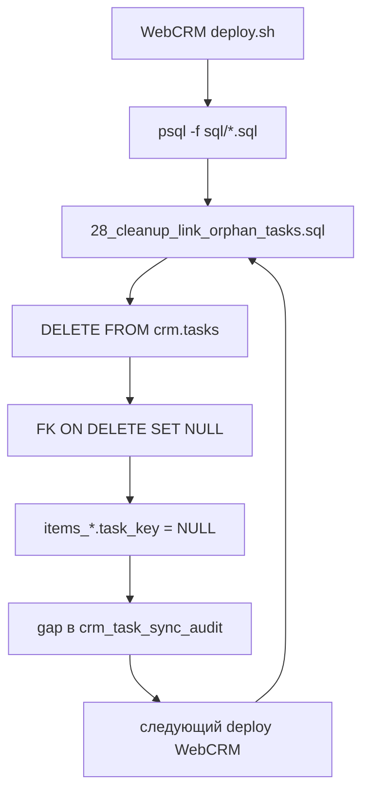

# Расследование: массовое удаление `crm.tasks` при deploy WebCRM

**Дата расследования:** 2026-07-16  
**База:** `monitor` на VPS `77.222.63.161`  
**Связанный проект MONITOR:** `/opt/monitor`  
**Связанный проект WebCRM:** `/opt/monitor/webcrm`  
**Аудитория:** агент/разработчик WebCRM для исправления deploy и миграций

---

## Краткий вывод

Массовое удаление задач **не вызвано** ночным ETL MONITOR и **не вызвано** runtime API WebCRM (uvicorn).  
**Наиболее вероятная и подтверждённая причина:** скрипт **`deploy/deploy.sh`** при каждом обновлении WebCRM **повторно выполняет все SQL-миграции**, включая деструктивные скрипты с `DELETE FROM crm.tasks`. Главный виновник — **`sql/28_cleanup_link_orphan_tasks.sql`**, который удаляет scoped ETL-задачи без связи `items_*.task_key`.

Повтор инцидента **13.07 и 16.07** объясняется тем, что `deploy.sh` не различает «уже применённые» и «одноразовые» миграции.

---

## Инциденты

| Дата (MSK) | Удалено | Разбивка | SSH / клиент |
|---|---:|---|---|
| **2026-07-13 15:04:22–15:04:33** | 25 093 | earthwork + avr + localwork ≈ 24 608; oati **485** | `91.246.17.231`, ключ `MONITOR/id_rsa` |
| **2026-07-16 10:12:05–10:12:17** | 26 958 | earthwork **24 175**, avr **2 034**, localwork **264**, oati **485** | тот же IP и ключ |

### Лог БД (`crm.tasks_deletion_log`)

```sql
SELECT date_trunc('second', deleted_at AT TIME ZONE 'Europe/Moscow') AS del_msk,
       count(*) AS n,
       count(*) FILTER (WHERE earthwork_id IS NOT NULL) AS ew,
       count(*) FILTER (WHERE oati_id IS NOT NULL) AS oati,
       count(*) FILTER (WHERE localwork_id IS NOT NULL) AS lw,
       count(*) FILTER (WHERE avr_mos_id IS NOT NULL) AS avr
FROM crm.tasks_deletion_log
GROUP BY 1
ORDER BY 1;
```

Результат по всем инцидентам:

| Поле | Значение |
|---|---|
| `db_user` | **`monitor`** (всегда) |
| `application_name` | **`psql`** (всегда, 52 051 записей) |
| `client_addr` | не логировался до `sql/33`; Postgres не пишет IP при `psql` через docker на localhost |

**Не** `uvicorn`, **не** `python`, **не** collector ETL.

### Хронология 16.07.2026

```
10:11:58  SSH login root ← 91.246.17.231 (RSA SHA256:4xDs6nwey7y61cyzuCPtQ97u5r8ZYrqDaifTkNaemC8)
10:12:00  второй SSH с того же IP
10:12:05  DELETE 26 473 задач (psql / monitor)
10:12:17  DELETE 485 oati-задач
10:12:40  третий SSH, disconnect
10:19:xx  WebCRM uvicorn — обычная работа UI (PATCH/GET tasks), не DELETE
```

Схема `deploy.sh`: **сначала SQL-миграции, потом `npm build`**. DELETE в 10:12 совпадает с фазой миграций, а не с рестартом backend.

Ночной `data_mos` 16.07 (03:00–03:33 MSK) отработал штатно; `crm_sync` создавал задачи, не удалял.

---

## Состояние БД перед удалением (16.07)

Аудит MONITOR (`scripts/crm_task_sync_audit.py`):

| Метрика | Значение |
|---|---:|
| Split-строк с geom | 31 500 |
| Связано (`task_key`) | 4 542 (14.4%) |
| **Gap** (geom без `task_key`) | **26 958** |
| Ложных `tasked` | 0 |

**Gap = 26 958 точно совпал с числом удалённых** — это ключевое доказательство связи с `28_cleanup`.

Отчёт: `/opt/monitor/reports/audit_20260716_before.md`

---

## Корневая причина в WebCRM

### 1. `deploy/deploy.sh` гоняет ВСЕ миграции при каждом deploy

Файл: `/opt/monitor/webcrm/deploy/deploy.sh`

```bash
echo "=== SQL migrations ==="
set -a
source .env
set +a
export PGPASSWORD="${DB_PASSWORD:-}"
for f in "$ROOT"/sql/[0-9]*.sql; do
  echo "  $(basename "$f")"
  psql -h "${DB_HOST:-localhost}" -U "${DB_USER:-monitor}" -d "${DB_NAME:-monitor}" -f "$f" >/dev/null
done
```

Проблемы:

1. **Нет учёта применённых миграций** — каждый `deploy.sh` / `update-both.sh` перезапускает весь каталог `sql/`.
2. Скрипты с пометкой «Run once» (18, 20, 21, 28) выполняются снова и снова.
3. Подключение `psql -U monitor` даёт в логе ровно `application_name=psql`, `db_user=monitor` — как при инциденте.

`deploy/update-both.sh` на локальной машине:

```bash
rsync ... root@77.222.63.161:/opt/monitor/webcrm/
ssh ... 'cd /opt/monitor/webcrm && ./deploy/deploy.sh'
```

### 2. Деструктивные SQL-файлы в `webcrm/sql/`

| Файл | Назначение (по комментариям) | `DELETE FROM crm.tasks` |
|---|---|---|
| `17_tasks_business_id_unique.sql` | дедупликация business-id | да (в цикле) |
| `18_earthwork_restore_point_tasks.sql` | **run once** — legacy earthwork | да |
| `20_oati_scoped_geometry_tasks.sql` | **run once** — legacy oati | да |
| `21_localwork_avr_scoped_geometry_tasks.sql` | **run once** — legacy localwork/avr | да |
| **`28_cleanup_link_orphan_tasks.sql`** | cleanup link-orphans | **да, массово** |

Runtime backend (`backend/app/`) **не содержит** `DELETE FROM crm.tasks` — только миграции и deploy.

### 3. Логика `28_cleanup_link_orphan_tasks.sql` (главный виновник)

Файл: `/opt/monitor/webcrm/sql/28_cleanup_link_orphan_tasks.sql`

Скрипт считает задачу «сиротой» и удаляет её, если:

- `is_field_data IS NOT TRUE` и `is_office_task IS NOT TRUE`
- есть scoped business-id (`oati_id` / `earthwork_id` / `localwork_id` / `avr_mos_id`)
- **нет ни одной** строки в `data_mos.items_*_{points,lines,polygons}` с `task_key = crm.tasks.key`

```sql
CREATE TEMP TABLE items_link_exists AS
SELECT ct.key FROM crm.tasks ct
WHERE EXISTS (
    SELECT 1 FROM data_mos.items_2855_points t WHERE t.task_key = ct.key
    UNION ALL ...
    UNION ALL SELECT 1 FROM data_mos.items_62461_polygons t WHERE t.task_key = ct.key
);

CREATE TEMP TABLE link_orphan_tasks AS
SELECT ct.key FROM crm.tasks ct
WHERE ...
  AND ct.key NOT IN (SELECT key FROM items_link_exists)
  AND (
      -- legacy non-scoped OR scoped (point:/line:/polygon:)
      ...
      OR (ct.earthwork_id ~ '^(point|line|polygon):')
      OR (ct.oati_id ~ '^(point|line|polygon):')
      ...
  );

DELETE FROM crm.tasks WHERE key IN (SELECT key FROM tasks_to_delete);
```

**Почему это убивает ETL-задачи MONITOR:**

- MONITOR создаёт `crm.tasks` с `user_created = ['etl', ...]` и scoped id (`point:123`, …).
- Связь — `data_mos.items_*.task_key → crm.tasks.key`.
- Если `task_key` на items = NULL (после прошлого DELETE, сбоя линковки, или рассинхрона), задача в `crm.tasks` **ещё существует**, но `28_cleanup` считает её сиротой и **удаляет**.
- При `ON DELETE SET NULL` на FK удаление `crm.tasks` обнуляет `task_key` на items → gap растёт → следующий deploy снова чистит.

Два батча DELETE (26 473 + 485) соответствуют разным DELETE-операциям в цепочке миграций при deploy (несколько файлов с `DELETE FROM crm.tasks` подряд). Число **485 oati** совпало с oati-gap в split-таблицах.

---

## Цепочка повреждений



Симптомы для пользователей:

- Пропадают `earthwork_id` / `localwork_id` / `avr_mos_id` в CRM/QGIS
- Ночной `data_mos` может показывать `crm_sync: inserted=0` при ложном `tasked`
- WebCRM UI продолжает работать для оставшихся задач (uvicorn только читает/обновляет)

---

## Что уже сделано на стороне MONITOR (16.07)

### Восстановление

```bash
cd /opt/monitor
docker compose exec -T db psql -U monitor -d monitor < sql/31_data_mos_reset_false_tasked.sql
docker compose exec collector python -m collector.scheduler --run backfill_data_mos_crm_tasks
docker compose exec collector python scripts/crm_task_sync_audit.py --output /app/reports/audit_20260716_after.md
```

Результат: **gap = 0**, linked = 31 500 (100%).  
Отчёты: `reports/audit_20260716_before.md`, `reports/audit_20260716_after.md`, `reports/crm_tasks_recovery_20260716.md`

### Защита `sql/33_crm_tasks_etl_delete_block.sql`

Применено на VPS:

- **Блок** `DELETE` для строк с `'etl' = ANY(user_created)`
- Лог `client_addr` в `crm.tasks_deletion_log`
- `RAISE WARNING` при DELETE > 100 строк за statement

**Важно для WebCRM:** следующий deploy с `28_cleanup` **упадёт** с ошибкой:

```text
DELETE blocked: crm.tasks row is owned by MONITOR ETL (user_created contains etl)
```

Это ожидаемо — защита работает. Deploy нужно чинить **до** следующего обновления.

---

## Задачи для исправления в WebCRM

### P0 — обязательно

#### 1. Ввести учёт миграций

Не выполнять `sql/*.sql` целиком при каждом deploy.

Минимальный вариант:

```sql
CREATE TABLE IF NOT EXISTS webcrm.schema_migrations (
    filename TEXT PRIMARY KEY,
    applied_at TIMESTAMPTZ NOT NULL DEFAULT NOW()
);
```

В `deploy.sh`:

```bash
for f in "$ROOT"/sql/[0-9]*.sql; do
  base=$(basename "$f")
  already=$(psql -tAc "SELECT 1 FROM webcrm.schema_migrations WHERE filename='$base'")
  if [[ -n "$already" ]]; then
    echo "  skip $base (already applied)"
    continue
  fi
  echo "  apply $base"
  psql ... -v ON_ERROR_STOP=1 -f "$f"
  psql ... -c "INSERT INTO webcrm.schema_migrations (filename) VALUES ('$base')"
done
```

#### 2. Исключить одноразовые миграции из автоматического deploy

Переместить в `sql/one_time/` (не в glob deploy) или пометить и пропускать:

- `17_tasks_business_id_unique.sql`
- `18_earthwork_restore_point_tasks.sql`
- `20_oati_scoped_geometry_tasks.sql`
- `21_localwork_avr_scoped_geometry_tasks.sql`
- **`28_cleanup_link_orphan_tasks.sql`**

Запускать вручную только после review и dry-run.

#### 3. Переписать `28_cleanup` — не удалять ETL-задачи

Варианты (выбрать один):

**A. Не трогать `user_created` с `'etl'`:**

```sql
AND NOT ('etl' = ANY(ct.user_created))
```

**B. Не DELETE, а только отчёт** — скрипт пишет CSV/лог, оператор решает.

**C. Перед cleanup вызывать MONITOR backfill** (см. ниже), cleanup только для legacy non-scoped id.

#### 4. Dry-run перед DELETE

В `28_cleanup` перед `DELETE` оставить:

```sql
SELECT 'orphans_to_delete' AS metric, COUNT(*)::text FROM link_orphan_tasks
UNION ALL ...
```

И в deploy **прерывать**, если `total_to_delete > 100`, пока не передан флаг `ALLOW_DESTRUCTIVE_MIGRATION=1`.

### P1 — желательно

- Разделить `sql/` на `schema/`, `one_time/`, `reports/` (только SELECT).
- В `link_health_check.sh` — алерт, но **без auto-delete**.
- Документировать порядок deploy с MONITOR: сначала ETL/backfill, потом WebCRM code, **без** destructive SQL.
- В `update-both.sh` — не вызывать полный SQL-цикл без проверки.

### P2 — согласование с MONITOR

Перед любым cleanup scoped-задач:

```bash
# на VPS MONITOR
docker compose exec collector python -m collector.scheduler --run backfill_data_mos_crm_tasks
docker compose exec collector python scripts/crm_task_sync_audit.py
# ожидание: gap = 0
```

Только при `gap = 0` имеет смысл чистить **legacy** non-scoped записи (18/20/21), но не scoped ETL.

---

## Проверка после исправления

### Чеклист WebCRM

- [ ] `deploy.sh` не перезапускает уже применённые файлы
- [ ] `28_cleanup` не в автоматическом deploy
- [ ] `28_cleanup` не удаляет `user_created @> '{etl}'`
- [ ] Dry-run / лимит на массовый DELETE
- [ ] Тестовый deploy на staging: `crm.tasks` count до/после не меняется неожиданно

### SQL для smoke-test после deploy

```sql
-- 1. Не должно быть новых записей в deletion_log после deploy
SELECT count(*) FROM crm.tasks_deletion_log
WHERE deleted_at > NOW() - INTERVAL '10 minutes';

-- 2. Gap должен остаться 0
-- (запускать crm_task_sync_audit.py на MONITOR)

-- 3. Scoped ETL tasks на месте
SELECT count(*) FILTER (WHERE earthwork_id LIKE 'point:%') AS ew_points,
       count(*) FILTER (WHERE oati_id LIKE 'point:%') AS oati_points
FROM crm.tasks
WHERE user_created[1] = 'etl';
```

### Симуляция `28_cleanup` без DELETE (для отладки)

```sql
-- Сколько задач сейчас посчитались бы «сиротами» (после backfill должно быть 0)
SELECT count(*) FROM crm.tasks ct
WHERE ct.is_field_data IS NOT TRUE AND ct.is_office_task IS NOT TRUE
  AND (ct.earthwork_id ~ '^(point|line|polygon):' OR ct.oati_id ~ '^(point|line|polygon):'
       OR ct.localwork_id ~ '^(point|line|polygon):' OR ct.avr_mos_id ~ '^(point|line|polygon):')
  AND NOT EXISTS (
      SELECT 1 FROM data_mos.items_62501_points t WHERE t.task_key = ct.key
      UNION ALL SELECT 1 FROM data_mos.items_2855_points t WHERE t.task_key = ct.key
      -- ... остальные split-таблицы
  );
```

После исправлений и backfill ожидается **0**.

---

## Связанные файлы

### WebCRM (`/opt/monitor/webcrm`)

| Путь | Роль |
|---|---|
| `deploy/deploy.sh` | **баг:** rerun all SQL |
| `deploy/update-both.sh` | rsync + deploy на 2 VPS |
| `sql/28_cleanup_link_orphan_tasks.sql` | **массовый DELETE** |
| `sql/17_*.sql`, `18_*.sql`, `20_*.sql`, `21_*.sql` | одноразовые DELETE |
| `scripts/link_health_check.sh` | проверка связей (без delete — ок) |
| `scripts/deploy_stable_links.sh` | deploy MONITOR sql/27 + WebCRM 23–26 |

### MONITOR (`/opt/monitor`)

| Путь | Роль |
|---|---|
| `sql/31_data_mos_reset_false_tasked.sql` | сброс ложного `tasked` |
| `sql/32_crm_tasks_delete_guard.sql` | лог удалений + reset `tasked` |
| `sql/33_crm_tasks_etl_delete_block.sql` | **блок DELETE ETL-задач** |
| `collector/jobs/backfill_data_mos_crm_tasks_job.py` | восстановление связей |
| `scripts/crm_task_sync_audit.py` | аудит gap/linked |
| `docs/crm_qgis_investigation.md` | общий чеклист CRM/QGIS |

---

## Критерии приёмки (Definition of Done)

1. Повторный `./deploy/deploy.sh` **не меняет** количество scoped ETL-задач в `crm.tasks`.
2. `crm.tasks_deletion_log` **пуст** после обычного deploy.
3. `crm_task_sync_audit.py` показывает **gap = 0** после deploy.
4. Одноразовые миграции документированы и запускаются только вручную с подтверждением.
5. `28_cleanup` либо удалён из pipeline, либо безопасен для ETL-задач MONITOR.

---

## Контакты / контекст

- IP оператора deploy: `91.246.17.231` (рабочая машина / VPN пользователя)
- SSH-ключ deploy: `MONITOR/id_rsa/id_rsa` → `SHA256:4xDs6nwey7y61cyzuCPtQ97u5r8ZYrqDaifTkNaemC8`
- БД: `host=localhost` (на VPS), `user=monitor`, `database=monitor`
- Task-sync сервисы MONITOR: `items_2855`, `items_62501`, `items_62441`, `items_62461`
- ETL login в `user_created`: **`etl`** (`collector/crm_task_sync_config.py`)

---

*Документ подготовлен командой MONITOR для передачи в репозиторий WebCRM. При исправлении сослаться на этот файл в PR/commit message.*
