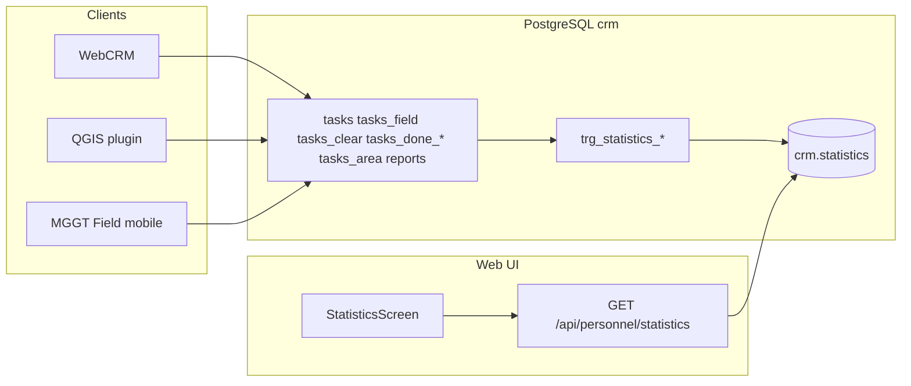

# Статистика — техническое описание (v2)

## Архитектура

Statistics v2 использует **DB-first** модель: события записываются триггерами PostgreSQL при изменениях в CRM-таблицах. WebCRM, QGIS и мобильное приложение — равноправные клиенты одной схемы `crm`.

Python-модуль [`backend/app/crm/statistics.py`](../backend/app/crm/statistics.py) отвечает только за **чтение** (дашборд) и служебные флаги `skip_*` для ложных срабатываний при возврате задач из поля. Прямой вызов `log_statistic()` для основных метрик v2 **не используется**.



## Таблица `crm.statistics`

Определение: [`sql/12_crm_statistics.sql`](../sql/12_crm_statistics.sql).

| Колонка | Тип | Описание |
|---------|-----|----------|
| `id` | BIGSERIAL | PK |
| `user_id` | UUID | FK → `crm.users`, nullable |
| `user_login` | TEXT | Логин исполнителя |
| `user_role` | TEXT | `field` или `office` |
| `object_type` | TEXT | `task` или `order` |
| `action` | TEXT | Код события (см. ниже) |
| `object_key` | UUID | UUID задачи или заказа |
| `created_at` | TIMESTAMPTZ | Время события |
| `metadata` | JSONB | `source`, `via`, и др. |

### Дедупликация

Функция `crm.statistics_insert_row()` не вставляет вторую строку с тем же `(object_type, object_key, action)`. Повторные операции по одной задаче не увеличивают счётчик.

### Роли

`crm.statistics_resolve_role(login)`:

- `field` → `field`
- `office`, `manager`, `admin` → `office`

## Коды событий v2

### Field (`user_role = field`)

| action | UI label | Условие |
|--------|----------|---------|
| `field_camera_survey` | Обследование камеральной задачи | INSERT `mggt_field.reports` **и** DELETE `crm.tasks_field` (по `tasks_key`) |
| `field_disruption_absent` | Отсутствие разрытия по задаче | INSERT `reports` **и** INSERT `crm.tasks_clear` |
| `field_disruption_found` | Обнаружение разрытия в поле | INSERT `reports` **и** INSERT/строка `crm.tasks` с `is_field_data = true` |
| `field_order_closed` | Закрытие заказа | `crm.tasks_area.status`: `wip` → `done`, `executor` — полевой пользователь |

### Office (`user_role = office`)

| action | UI label | Условие |
|--------|----------|---------|
| `office_analise_started` | Анализ начат | `tasks_area.analise_started_at` NULL → NOT NULL + `analise_started_by` |
| `office_analise_completed` | Анализ завершён | `analise` FALSE → TRUE или `analise_finished_at` set + `analise_finished_by` |
| `office_disruption_absent` | Разрытие отсутствует | INSERT `crm.tasks_clear` без field-report, login из `user_created[1]` |
| `office_camera_tasks_created` | Создано камеральных задач | INSERT `crm.tasks` с `is_office_task = true` |
| `office_closed_illegal` | Закрыто нелегально | INSERT `crm.tasks_done_illegal` |
| `office_closed_legal` | Закрыто легально | INSERT `crm.tasks_done_legal` |

Подписи в UI: [`frontend/src/lib/statisticsLabels.ts`](../frontend/src/lib/statisticsLabels.ts).

## Триггеры

Файл: [`sql/15_statistics_v2.sql`](../sql/15_statistics_v2.sql).

| Триггер | Таблица | События |
|---------|---------|---------|
| `trg_statistics_reports_insert` | `mggt_field.reports` | field: корреляция report + companion |
| `trg_statistics_tasks_field_delete` | `crm.tasks_field` | `field_camera_survey` |
| `trg_statistics_tasks_clear_insert` | `crm.tasks_clear` | `field_disruption_absent` или `office_disruption_absent` |
| `trg_statistics_tasks_field_data_insert` | `crm.tasks` (WHEN `is_field_data`) | `field_disruption_found` |
| `trg_statistics_tasks_insert` | `crm.tasks` | `office_camera_tasks_created` (только `is_office_task`) |
| `trg_statistics_tasks_done_legal_insert` | `crm.tasks_done_legal` | `office_closed_legal` |
| `trg_statistics_tasks_done_illegal_insert` | `crm.tasks_done_illegal` | `office_closed_illegal` |
| `trg_statistics_tasks_area_status` | `crm.tasks_area` | `field_order_closed` |
| `trg_statistics_tasks_area_analise` | `crm.tasks_area` | `office_analise_started`, `office_analise_completed` |

### Корреляция report + companion (field)

Порядок INSERT/DELETE в одной транзакции не гарантирован. Используется **двусторонняя** корреляция:

- `crm.statistics_match_report(task_key, window = 5 min)` — последний report по `tasks_key`
- Триггеры на `reports`, `tasks_field`, `tasks_clear`, `tasks` вызывают emit при наличии пары

### Skip-флаги (WebCRM)

| Флаг | Назначение |
|------|------------|
| `crm.statistics_skip_field_complete = true` | DELETE из `tasks_field` без stat (возврат задачи в активные) |
| `crm.statistics_skip_area_complete = true` | Зарезервирован; v2 не блокирует field close через Python |

Контекст-менеджер: `skip_field_complete_trigger()` в [`store.py`](../backend/app/crm/store.py) → `remove_task_from_field()`.

## Контракт audit-полей (QGIS / WebCRM)

Формат: `TEXT[] = [login, ISO-8601 UTC]` — см. [`sql/06_task_user_audit.sql`](../sql/06_task_user_audit.sql), helper [`user_audit.py`](../backend/app/crm/user_audit.py).

| Операция | Обязательные поля |
|----------|-------------------|
| INSERT snapshot (`tasks_clear`, `tasks_done_*`) | `user_created[1]` |
| INSERT камеральной задачи | `user_created[1]`, `is_office_task = true` |
| Начало анализа | `analise_started_by`, `analise_started_at` |
| Завершение анализа | `analise_finished_by`, `analise_finished_at` (или `analise = true`) |

Без login строка stat **не создаётся**. Login должен существовать в `crm.users`.

### Проверка на проде (2026-06)

После **26.06.2026** все snapshot INSERT содержат `user_created`; покрытие eligible-строк stat = 100%. Исторические пробелы (18–25.06) без login в stat не попали.

## API

```
GET /api/personnel/statistics?date_from=YYYY-MM-DD&date_to=YYYY-MM-DD
```

Query (опционально, manager/admin): `user_role`, `object_type`, `user_login`.

Ответ [`PersonnelStatisticsOut`](../backend/app/crm/schemas.py):

```json
{
  "field_summary": [{
    "user_login": "...",
    "camera_surveys": 0,
    "disruption_absent": 0,
    "disruption_found": 0,
    "orders_closed": 0
  }],
  "office_breakdown": [{
    "user_login": "...",
    "object_type": "task",
    "action": "office_disruption_absent",
    "action_count": 1
  }],
  "date_from": "...",
  "date_to": "...",
  "scope": "all"
}
```

Права: [`personnel.py`](../backend/app/routes/personnel.py) — `field`/`office` только `scope: self`; `manager`/`admin` — `all` + фильтры.

## Frontend

- [`StatisticsScreen.tsx`](../frontend/src/components/StatisticsScreen.tsx) — UI
- Поле: 4 колонки / карточки
- Офис: breakdown-таблица, только 6 action из `OFFICE_STATISTICS_ACTIONS`

## Миграции и backfill

| Файл | Назначение |
|------|------------|
| `sql/12_crm_statistics.sql` | Таблица, `statistics_insert_row`, legacy triggers (перезаписываются v2) |
| `sql/15_statistics_v2.sql` | Helpers + триггеры v2 |
| `sql/16_statistics_v2_backfill.sql` | DELETE legacy action + idempotent INSERT v2 из источников |

Порядок деплоя: `15` → `16` (важно: `16` после `15`, т.к. использует `statistics_audit_*`).

`deploy/deploy.sh` прогоняет все `sql/[0-9]*.sql` идемпотентно.

## Диагностика

```sql
-- Распределение по action
SELECT action, COUNT(*) FROM crm.statistics GROUP BY action ORDER BY action;

-- Snapshot без login (stat не будет при новых INSERT)
SELECT COUNT(*) FROM crm.tasks_clear
WHERE user_created IS NULL OR NULLIF(TRIM(user_created[1]), '') IS NULL;

-- Eligible clear без stat
SELECT c.task_key FROM crm.tasks_clear c
JOIN crm.users u ON u.login = c.user_created[1] AND u.role IN ('office','manager','admin')
WHERE NOT EXISTS (
  SELECT 1 FROM crm.statistics s
  WHERE s.action = 'office_disruption_absent' AND s.object_key = c.task_key
)
AND NOT EXISTS (
  SELECT 1 FROM mggt_field.reports r
  JOIN crm.users fu ON fu.login = r.username AND fu.role = 'field'
  WHERE r.tasks_key = c.task_key
);

-- Активные триггеры
SELECT tgname FROM pg_trigger t
JOIN pg_class c ON c.oid = t.tgrelid
JOIN pg_namespace n ON n.oid = c.relnamespace
WHERE tgname LIKE 'trg_statistics%' AND NOT t.tgisinternal;
```

## Ограничения

1. **Один счётчик на (задача/заказ, тип события)** — повторное обследование той же задачи не увеличит `field_camera_survey`.
2. **Backfill `field_camera_survey`** — эвристика без журнала DELETE; live-триггеры точнее.
3. **Field close заказа** — при `status → done` и field `executor` без проверки `user_last_edit`; офисное закрытие заказа в stat v2 не учитывается.
4. **Окно корреляции report** — 5 минут; события вне окна могут не склеиться (редко при нормальной синхронизации mobile).

## Связанные файлы

| Компонент | Путь |
|-----------|------|
| SQL v2 | `sql/15_statistics_v2.sql`, `sql/16_statistics_v2_backfill.sql` |
| Python read | `backend/app/crm/statistics.py` |
| API | `backend/app/routes/personnel.py` |
| UI labels | `frontend/src/lib/statisticsLabels.ts` |
| UI screen | `frontend/src/components/StatisticsScreen.tsx` |
